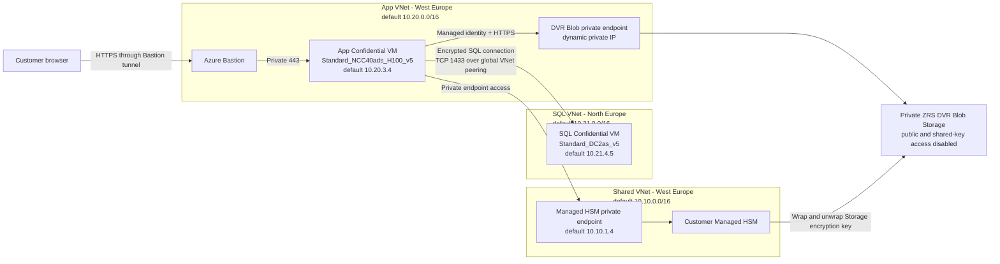
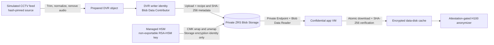

# Technical Architecture — Citizen Registry Advanced

## System Overview

### Deployed Stage 2 Topology



The app and SQL Server run on separate Confidential VMs and separate regional VNets. Global VNet
peering carries the private SQL connection; neither VM has a public IP. The app VM combines an
AMD SEV-SNP confidential CPU boundary with an NVIDIA H100 in production confidential-computing
mode. Bastion provides workstation access, and the app reaches Managed HSM through its private
endpoint in the shared VNet.

The durable CCTV source of record is a ZRS Blob Storage account in the Stage 2 resource group.
Its Blob endpoint is reachable only through a Private Endpoint in the app VNet. A dedicated DVR
writer identity uploads prepared footage; the app identity has read-only Blob access and downloads
an atomic SHA-256-verified processing cache to the encrypted data disk. Storage service encryption
uses a separate non-exportable RSA-HSM customer-managed key and encryption identity.

## Data Flow & Security

### 1. User → App Connection (mTLS)

```text
User Machine
    │
    ├─ SSH via Bastion
    │  └─ Port 2222 → Bastion → Port 22 (CVM)
    │
    └─ HTTPS via Bastion
       └─ Port 8443 (mTLS)
          └─ Client certificate required for protected CRUD operations

         ↓↓↓ (Mutual TLS Handshake) ↓↓↓

    Customer-issued User Certificate
         │
    Customer-issued App Certificate
         │
    ↓ TLS 1.2/1.3 ↓

Confidential App VM
    ├─ nginx (reverse proxy)
    │  ├─ TLS and mTLS termination
    │  ├─ Security headers
    │  └─ Request forwarding
    │
    ├─ Flask App (port 8000)
    │  ├─ Database driver
    │  ├─ Attestation status
    │  └─ Confidential GPU processing
    │
    └─ Azure guest attestation
       └─ SEV-SNP boot evidence
```

### 2. App → Database (Global VNet Peering + TLS)

The database is a second Confidential VM in the North Europe SQL VNet. By default, the SQL CVM
uses private IP `10.21.4.5`; the West Europe app VNet reaches it over global VNet peering.

```text
Flask App (8000)
    │
    ├─ SQL Connection String
   │  ├─ Server: 10.21.4.5 (default SQL CVM private IP)
    │  ├─ Port: 1433
    │  ├─ Encrypt: yes
    │  ├─ TrustServerCertificate: yes
    │  └─ Database: citizendb
    │
    ↓ (pyodbc with ODBC Driver 18)
    
Private Network
   ├─ App CVM → SQL CVM over global VNet peering
   ├─ NSG rule: Allow TCP 1433 from the peered app VNet
    ├─ All traffic encrypted (TLS)
    └─ No internet exposure
    
SQL Server Confidential VM
    ├─ SQL Server
   ├─ AMD SEV-SNP confidential compute
   ├─ Encryption at host
    ├─ citizen_registry table
   └─ Private SQL subnet only
```

### 3. DVR → Analyzer (Private Link + Managed Identity)



The application never receives the Storage encryption key or HSM key material. It receives
plaintext only after Azure Storage decrypts an authorized Blob read, then verifies the object
against its `source_sha256` metadata before atomically replacing the local cache. Temporary ingest
files are deleted after upload. The UI technical-details endpoint exposes only resource names,
network and authentication modes, key identifiers, operations, and exportability.

### 4. App → Managed HSM (Private Link + Managed Identity)

```
Flask App
    │
    ├─ Azure Identity SDK
    │  └─ Managed Identity credential
    │
   ├─ Azure managed disk service
   │  └─ HSM-backed CMK through the Disk Encryption Set
    │
    ↓ (DNS resolution via Private DNS Zone)
    
Private DNS Zone (privatelink.managedhsm.azure.net)
   └─ A record → 10.10.1.4 (HSM private endpoint IP)

Private Link Endpoint
   ├─ VNet: 10.10.0.0/16
   ├─ Subnet: 10.10.1.0/24
    └─ HSM connectivity (encrypted)

Managed HSM
   ├─ Key operations
   │  ├─ Read/Wrap/Unwrap for the DES identity
   │  └─ Attestation-gated release for Azure CVM Orchestrator
    │
    └─ Audit logging
       └─ All operations logged
```

## Security Architecture

### 1. Authentication & Authorization

```
┌─────────────────────────────────────┐
│  Azure Attestation Service          │
│  ─────────────────────────────────  │
│  ✓ Publishes provider metadata      │
│  ✓ Supports guest attestation flows │
│  ✓ Does not issue demo mTLS certs   │
└─────────────────────────────────────┘
         │
         ├─ Policy: Attestation_v1
         │  ├─ Only attested CVMs allowed
         │  ├─ Check OS disk state
         │  ├─ Verify app SHA256
         │  └─ Enforce TLS version
         │
         └─ Claims Issued
            ├─ subject: cvm-identity
            ├─ aud: citizen-registry
            ├─ sgx-is-debuggable: false
            └─ exp: (1 hour)
```

### 2. Encryption Layers

| Layer | Type | Keys | Protection |
|-------|------|------|-----------|
| **App OS disk** | AES-256 (at rest) | Managed HSM-backed customer-managed key | Disk Encryption Set |
| **DVR source Blob** | Storage service encryption + infrastructure encryption | Managed HSM-backed customer-managed key | ZRS Storage; private endpoint only |
| **Analyzer cache** | Managed disk encryption at rest | App data-disk encryption boundary | Atomic SHA-256-verified local copy |
| **SQL VM storage** | Encryption at host | Platform-managed keys | Encrypts data through the Azure storage path |
| **Browser network** | TLS 1.2/1.3 (in transit) | Customer-issued server and client certificates | mTLS for protected CRUD operations |
| **SQL network** | TLS (in transit) | SQL Server certificate | Encrypted private connection over global VNet peering |
| **CPU memory** | SEV-SNP (runtime) | Hardware TEE | App and SQL CVM isolation |
| **GPU memory** | H100 confidential-computing mode | Hardware TEE | Attested confidential inference boundary |

### 3. Network Isolation

```
Internet ━━━━ BLOCKED ━━━━━ (No public access to resources)
   │
   └─→ Bastion Public IP (only entry point)
        │
        └─→ SSH/RDP tunnel
            │
            └─→ Private VNet (10.0.0.0/16)
                │
                ├─→ App Subnet (10.0.3.0/24)
                │   ├─ CVM (no public IP)
                │   └─ DVR Blob private endpoint
                │
                ├─→ DB Subnet (10.0.4.0/24)
                │   └─ Database (no public IP)
                │
                └─→ Private Link Subnet (10.0.1.0/24)
                    └─ HSM endpoint (no public IP)

NSG Rules (Explicit Allow):
  • Bastion ← Internet (port 443)
  • App ← Bastion (port 22, 3389)
  • Database ← App (port 1433)
  • HSM ← App (port 443, private link)
   • DVR Blob ← App (port 443, private endpoint and private DNS)
```

### 4. Managed Identity Permissions

```
Confidential VM (Managed Identity: cvm-identity)
    │
   ├─→ RBAC on Managed HSM
   │   └─ Managed HSM Crypto Auditor on the OS-disk key
   │      └─ Read non-secret key metadata and release policy only
   │
   ├─→ RBAC on DVR Storage
   │   └─ Storage Blob Data Reader at Storage account scope
   │      └─ Download source footage; cannot upload or delete
    │
    ├─→ RBAC on Database
    │   └─ SQL Login: sqladmin
    │      ├─ Read citizen_registry
    │      ├─ Write citizen_registry
    │      └─ Execute stored procedures
    │
    └─→ RBAC on Attestation Service
        └─ Role: Attestation Reader (via policy)
           └─ Read attestation tokens

   DVR writer identity
      └─→ Storage Blob Data Contributor at Storage account scope
         └─ Upload the prepared source and integrity metadata

   Storage encryption identity
      └─→ Managed HSM Crypto Service Encryption User on the DVR key
         └─ Wrap and unwrap Storage account encryption keys
```

## Deployment Process

### Stage 1: Shared Infrastructure

```
1. Parse Parameters
   ├─ Prefix: yourprefix
   ├─ Location: northeurope
   └─ Validate naming conventions

2. Create Resource Group
   └─ {Prefix}sharedinfra (e.g., yourprefixsharedinfra)

3. Deploy Bicep Template (shared-infra.bicep)
   ├─ Virtual Network (10.0.0.0/16)
   ├─ Private subnets
   ├─ Network Security Groups
   ├─ Managed HSM (B1 SKU)
   ├─ Private Link endpoint
   ├─ Private DNS zones
   └─ Role assignments

4. Initialize Security Domain
   └─ Run: .\scripts\initialize-hsm.ps1

5. Output Shared Resources
   ├─ VNet ID
   ├─ HSM ID & endpoint
   ├─ Private DNS zone ID
   └─ Subnet IDs (for Stage 2)
```

### Stage 2: App Instance

```
1. Parse Parameters
   ├─ Prefix: yourprefix
   ├─ SharedInfraRg: yourprefixsharedinfra
   ├─ Location: northeurope
   ├─ CvmSize: Standard_DC2as_v5
   └─ Validate and link to shared infra

2. Create Resource Group
   └─ {Prefix}{random5digit}app (e.g., yourprefix12345app)

3. Deploy Bicep Template (app-instance.bicep)
   ├─ Virtual Network (10.0.0.0/16, different VNet)
   ├─ NSGs (app, db, bastion)
   ├─ Confidential VM
   │  ├─ Image: Ubuntu 24.04 LTS Gen2
   │  ├─ Confidential OS disk encryption
   │  ├─ Managed Identity attached
   │  └─ SSH key-based auth
   ├─ Database (SQL Server on ACC)
   ├─ Bastion host
   ├─ Attestation Service
   ├─ Private ZRS DVR Storage account
   │  ├─ Public network, anonymous Blob, and shared-key access disabled
   │  ├─ Infrastructure encryption and Managed HSM CMK
   │  ├─ Seven-day Blob and container soft delete
   │  └─ Blob Private Endpoint and private DNS
   └─ DVR writer, analyzer reader, and Storage encryption identities

4. Seed Private DVR Source
   ├─ Normalize the hash-pinned source to the finite MP4
   ├─ Upload with the DVR writer identity and integrity metadata
   ├─ Download with the analyzer identity through Private Link
   └─ Delete temporary ingest files after verified cache replacement

5. Configure mTLS
   └─ Cloud-init creates the Norland demo PKI and installs nginx configuration

6. Setup Bastion
   └─ Bicep deploys Standard Bastion with tunneling enabled

7. Seed Database
   └─ App migration creates the expanded schema and 100 fictional records

8. Output App Resources
   ├─ CVM ID & private IP
   ├─ Bastion endpoint
   ├─ Attestation service URI
   ├─ DVR Blob URI and identity client ID
   └─ Connection strings
```

## Deployment Timeline

| Stage | Component | Time | Notes |
|-------|-----------|------|-------|
| 1.1 | Resource Group | 1s | Instant |
| 1.2 | Virtual Network | 5s | Create subnets |
| 1.3 | Managed HSM | 120s | Provisioning |
| 1.4 | Private Link | 10s | Create endpoint |
| 1.5 | Private DNS | 5s | Configure zones |
| **Total Stage 1** | | **~2-3 min** | Shared infra ready |
| 2.1 | Resource Group | 1s | Instant |
| 2.2 | Virtual Network | 5s | Create subnets |
| 2.3 | NSGs & NIC | 10s | Create interfaces |
| 2.4 | Confidential VM | 60s | Provisioning |
| 2.5 | Database Server | 90s | SQL install |
| 2.6 | Bastion | 30s | Deploy host |
| 2.7 | Attestation Service | 15s | Create provider |
| 2.8 | DVR Storage + Private Link | 30-90s | Policy evaluation, CMK, DNS, and RBAC |
| 2.9 | DVR ingest and cache | Source dependent | Normalize, upload, download, and verify |
| **Total Stage 2** | | **~5-7 min** | App ready |

## File Structure & Purposes

```
citizen-registry-advanced/
│
├─ README.md                           # Detailed architecture & setup guide
├─ QUICKSTART.md                       # 10-minute getting started guide
├─ Deploy-SharedInfra.ps1              # Stage 1 orchestration script
├─ Deploy-AppInstance.ps1              # Stage 2 orchestration script
├─ .gitignore                          # Exclude secrets/keys from git
│
├─ bicep/
│  ├─ shared-infra.bicep              # Managed HSM + VNet deployment
│  ├─ app-instance.bicep              # Stage 2 composition
│  └─ dvr-storage.bicep               # Private CMK-backed DVR Storage + RBAC
│
├─ scripts/
│  ├─ initialize-hsm.ps1              # HSM security domain setup
│  └─ seed-database.ps1               # Database initialization
│
└─ app-instance/app-src/
   ├─ app.py                          # Flask app and safe DVR details API
   ├─ dvr_storage.py                  # Managed-identity Blob transfer + integrity checks
   ├─ video_anonymizer.py             # Attestation-gated CCTV worker
   ├─ nginx.conf                      # Reverse proxy (mTLS config)
   └─ templates/
      ├─ index.html                   # Registry UI
      └─ cctv.html                    # Synchronized CCTV comparison and details
```

## Performance & Scalability

### Single App Instance Resources

| Tier | Default resource | Workload |
|---|---|---|
| App | `Standard_NCC40ads_H100_v5` | Flask/nginx, SDXL portraits, and MTCNN CCTV anonymization on one H100 |
| Database | `Standard_DC2as_v5` | SQL Server persistence on an AMD SEV-SNP Confidential VM |

The sample does not assert production throughput or latency targets. Measure registry traffic,
portrait generation, video processing, database latency, and cross-region network latency with a
representative workload before selecting production capacity.

### Horizontal Scaling

The deployment scripts create one app CVM and one SQL CVM. Horizontal app scaling, shared media
state, load balancing, and SQL high availability are not implemented by this demo. A production
design must preserve per-instance CPU and GPU attestation gates, private connectivity, certificate
validation, and database consistency while adding those capabilities.

## Disaster Recovery

### Backup Strategy

```
1. Managed HSM
   ├─ Security domain backup (offline, in secure facility)
   └─ Key rotation policy (quarterly)

2. Database
   ├─ Automated backups: Daily
   ├─ Retention: 7-35 days
   ├─ Geo-redundant: Yes (paired region)
   └─ Point-in-time restore: Supported

3. DVR footage
   ├─ ZRS durability within the deployment region
   ├─ Seven-day Blob and container soft delete
   ├─ CMK recovery depends on Managed HSM backup and key retention
   └─ This sample does not configure cross-region Blob replication

4. Application Code
   ├─ Git repository: GitHub (public)
   ├─ Secrets: Git-ignored (not in repo)
   ├─ Configuration: Key Vault (HSM-backed)
   └─ Certificates: HSM-stored

Recovery Time Objective (RTO): 30 minutes (full redeploy)
Recovery Point Objective (RPO): 1 hour (database backup)
```

## Cost Optimization

### Current Pricing (verified September 8, 2026)

| Core resource | West Europe USD retail rate | 8-hour run | 730 hours |
|---|---:|---:|---:|
| Linux `Standard_NCC40ads_H100_v5` | $8.90/hour | $71.20 | $6,497 |
| Managed HSM Standard B1 | $3.20/hour | $25.60 | $2,336 |
| **Core subtotal** | **$12.10/hour** | **$96.80** | **$8,833** |

These are planning estimates, not quotes. The SQL CVM and SQL Server licensing, Bastion, disks,
Private Link, VNet peering, monitoring, and data transfer are additional. Managed HSM has no
stopped state and continues hourly billing while provisioned. ZRS Storage capacity, operations,
Private Endpoint, and private DNS also incur charges. See the [README cost warning and
live pricing links](README.md#cost-warning-and-controls) before deployment.

### Cost-Saving Options

1. **Run short demonstrations** — Schedule a bounded window and enable VM auto-shutdown.
2. **Verify deallocation** — Confirm both VMs show **Stopped (deallocated)** after use.
3. **Delete app instances** — Remove residual disks and networking between demonstrations.
4. **Delete shared infrastructure after the final run** — Preserve the Managed HSM security-domain backup and key-recovery plan first.
5. **Consider Spot only for disposable tests** — The observed H100 Spot meter is cheaper but interruptible and not guaranteed to be available.

---

For more details, refer to:
- [README.md](README.md) — Deployment guide
- [QUICKSTART.md](QUICKSTART.md) — 10-minute setup
- Azure Docs: Confidential Computing, Managed HSM, Azure Attestation
