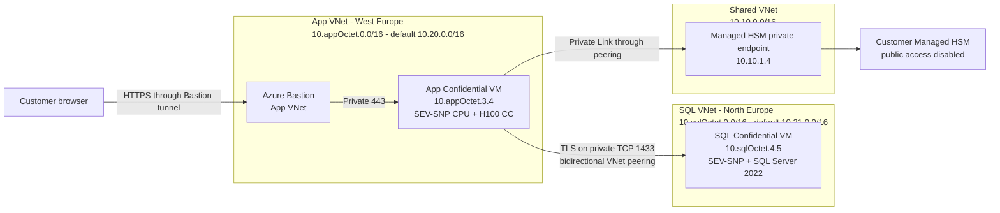
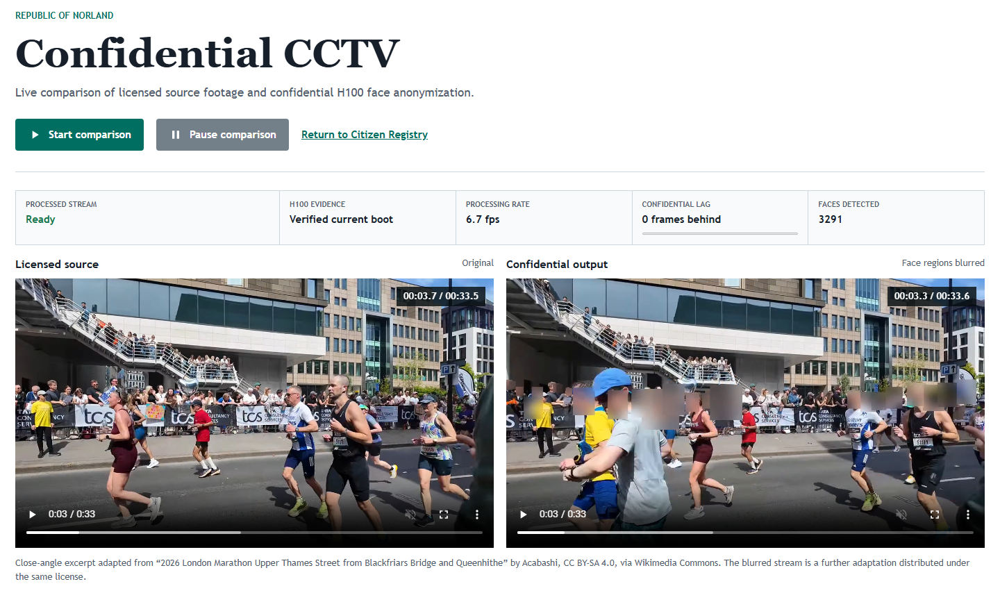
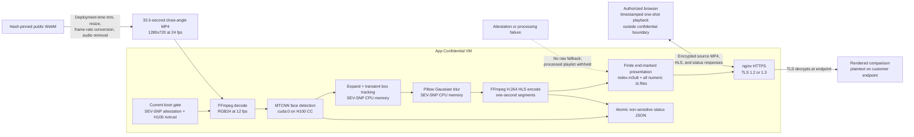
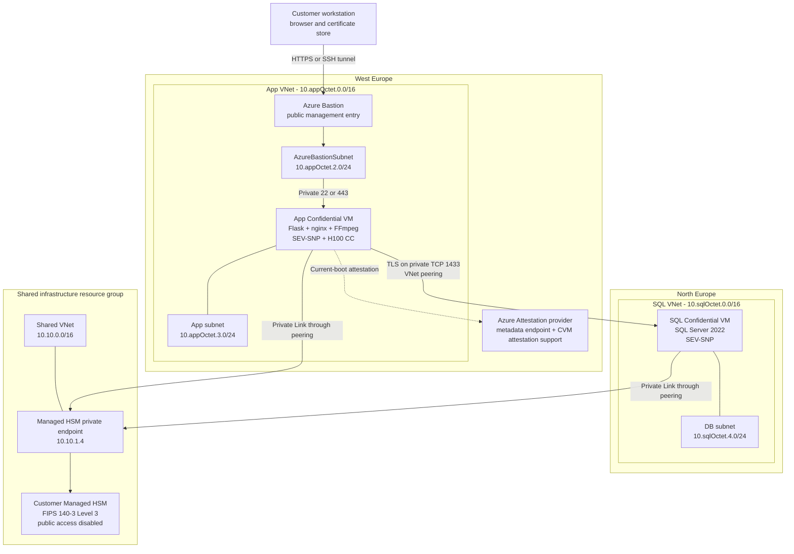
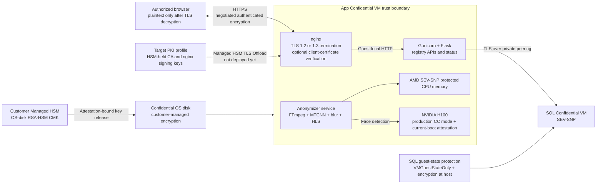
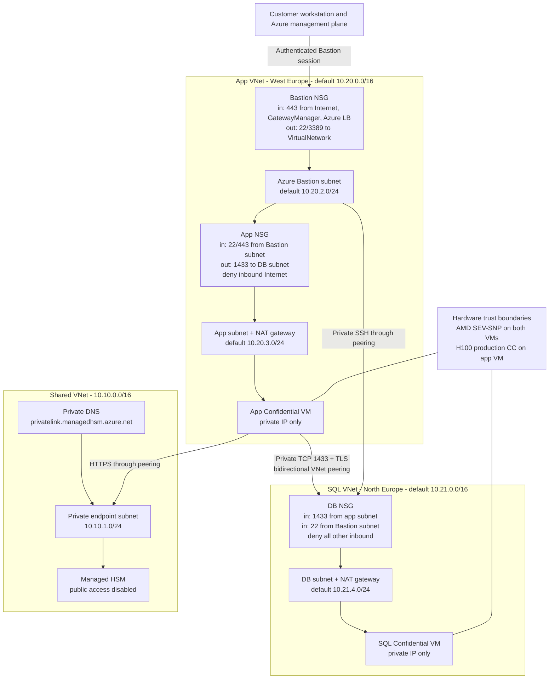
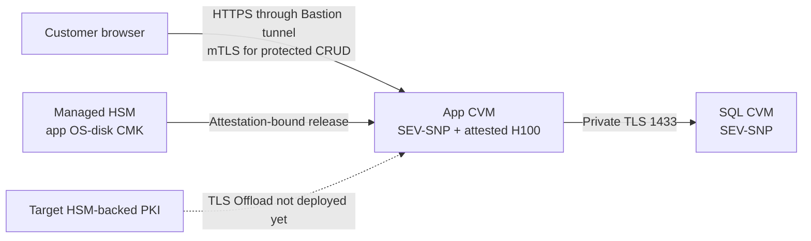
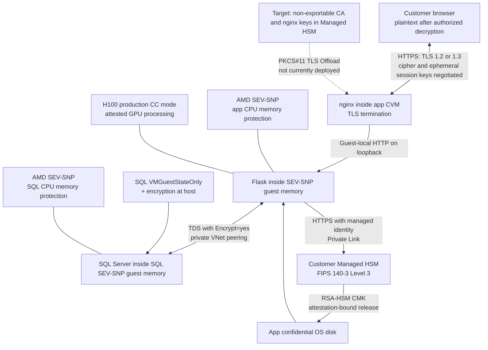
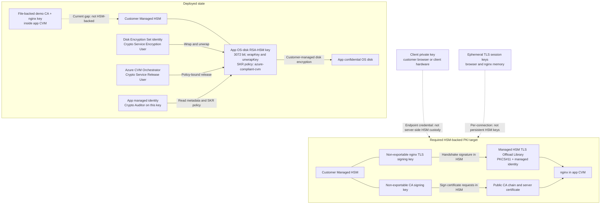

# Citizen Registry Advanced — Two-Stage Confidential Deployment

**Topology:** Customer Managed HSM ↔ App Confidential H100 GPU VM ↔ SQL Server Confidential VM

> **Implementation status:** Stage 2 now provisions an RSA-HSM customer-managed key in the shared Managed HSM and a `ConfidentialVmEncryptedWithCustomerKey` Disk Encryption Set for the app CVM OS disk. Azure Confidential VM secure key release binds that key to the app VM's attested vTPM/platform state. The SQL CVM uses `VMGuestStateOnly` confidential guest-state protection and encryption at host, not the app disk's HSM-backed DES. Azure Attestation is also deployed for the demo's explicit attestation endpoint; the Flask health check reports endpoint reachability, not a full quote-verification result. The demo certificate chain is CA-signed and PKI-shaped for Norland IT, but is not publicly trusted.
**Author:** Autonomous AI-Assisted Development  
**GPU configuration updated:** September 3, 2026

---

## Cost Warning and Controls

> [!WARNING]
> This is an expensive demonstration. In West Europe, the app's Linux
> `Standard_NCC40ads_H100_v5` VM is **$8.90/hour** pay-as-you-go, and the required
> Managed HSM Standard B1 pool is **$3.20/hour**. Those two resources alone cost
> **$12.10/hour**, **$290.40/day**, or approximately **$8,833/month** at 730 hours.
> SQL Server licensing/compute, the SQL CVM, Bastion, disks, Private Link, VNet peering,
> logs, and data transfer are additional.

Prices are USD retail estimates retrieved September 8, 2026. They are planning figures,
not quotes; region, currency, operating system, agreement, and meter changes affect the
actual bill.

| Core resource | Current retail rate | 4 hours | 8 hours | 24 hours | 730 hours |
|---|---:|---:|---:|---:|---:|
| H100 app CVM, Linux PAYG | $8.90/hour | $35.60 | $71.20 | $213.60 | $6,497 |
| Managed HSM Standard B1 | $3.20/hour | $12.80 | $25.60 | $76.80 | $2,336 |
| **Core subtotal** | **$12.10/hour** | **$48.40** | **$96.80** | **$290.40** | **$8,833** |

### Keep Demo Runs Short

1. **Deploy for a scheduled test window.** Prefer a 4-8 hour demonstration run over an
  always-on deployment. Create a budget and cost alert before provisioning.
2. **Enable VM auto-shutdown immediately.** Apply it to both the H100 app CVM and SQL CVM.
  Verify the VMs reach **Stopped (deallocated)**; an OS shutdown or **Stopped** state can
  continue compute billing. Deallocation stops VM compute charges, but attached disks and
  networking resources can still incur charges.
3. **Do not leave Managed HSM provisioned for an occasional demo.** Managed HSM has no
  stop/deallocate state and its hourly pool charge continues while it is provisioned. Share
  one pool across authorized workloads when isolation requirements permit, or delete the
  Stage 1 shared infrastructure after the final run only after preserving the security-domain
  backup and confirming the key-recovery plan.
4. **Delete Stage 2 after each run.** Retaining an H100 VM in a deallocated state avoids compute
  charges but still leaves disk and related resource costs. Full Stage 2 cleanup gives the
  largest savings between demos.
5. **Treat Spot as optional and interruptible.** The September 2026 West Europe Linux Spot meter
  was about **$1.64/hour**, but capacity and eviction are not guaranteed. Use it only if the
  deployment and confidential GPU processing can tolerate interruption; never budget on Spot
  availability.
6. **Use commitments only for sustained workloads.** Reservations or savings plans may reduce
  VM cost, but they are usually a poor fit for a short-lived sample. Confirm that the exact
  confidential GPU SKU and region are eligible before committing.

Check current prices before every deployment:

- [Azure Key Vault Managed HSM pricing](https://azure.microsoft.com/pricing/details/key-vault/)
- [Azure Virtual Machines pricing](https://azure.microsoft.com/pricing/details/virtual-machines/linux/)
- [Azure pricing calculator](https://azure.microsoft.com/pricing/calculator/)
- [Microsoft Cost Management budgets](https://learn.microsoft.com/azure/cost-management-billing/costs/tutorial-acm-create-budgets)

### Confidential-Compute and Browser-Protection Boundary

All sensitive server-side application processing runs within customer-controlled confidential
compute. Flask, FFmpeg decoding/encoding, and CPU-side frame handling run in the app VM's AMD
SEV-SNP-protected environment; face detection runs on its production-CC-mode, current-boot-attested
NVIDIA H100; and SQL Server runs on a separate AMD SEV-SNP Confidential VM. The browser, Azure
Bastion, Azure control plane, networking services, and Azure Attestation are outside those guest
confidential-compute boundaries. Data is necessarily plaintext in the authorized end user's browser
after TLS decryption, so the endpoint and screen remain part of the customer's security responsibility.

Every registry page, JSON response, source-video response, and anonymized HLS segment sent to the
browser is protected in transit by HTTPS terminated by nginx inside the app Confidential VM. nginx
permits TLS 1.2 and TLS 1.3 and limits TLS 1.2 negotiation to OpenSSL `HIGH:!aNULL:!MD5` cipher
suites. The browser and nginx negotiate the authenticated symmetric cipher and ephemeral session
keys during each handshake; modern TLS 1.3 clients normally select AES-GCM or ChaCha20-Poly1305.
The configuration does not claim that one fixed cipher is selected for every client.

The required production profile keeps the PKI authority and server private signing key in the
customer's Managed HSM. nginx uses the Microsoft Managed HSM TLS Offload Library through its
PKCS#11 interface; the library uses the app VM's managed identity and the Managed HSM REST API to
perform TLS-handshake signatures without exporting the server key. Public X.509 certificates and
the CA trust chain may be distributed normally because they contain no private key material. The
customer owns the HSM, controls its local RBAC and key lifecycle, and explicitly distributes the CA
trust anchor. HTTPS server authentication protects all browser traffic, while protected create,
update, and delete operations additionally require a customer-issued client certificate (mTLS).

An mTLS client private key is an endpoint credential and must remain available to the authorized
browser, normally in the customer's OS/browser certificate store or a customer-controlled client
hardware provider; it cannot remain solely in the server-side Managed HSM. “HSM-backed PKI” in this
document therefore means that the CA signing key and nginx server signing key are non-exportable
Managed HSM keys. It does not mean that public certificates or browser endpoint keys are stored in
Managed HSM.

> **Current implementation gap:** the checked-in Stage 2 bootstrap still generates the demo CA,
> nginx server key, and client key as files under `/etc/citizen-registry/certs` inside the app
> Confidential VM. Managed HSM currently holds only the confidential OS-disk CMK. Do not describe
> the deployed demo as HSM-backed PKI until `ssl_certificate_key` is configured through the
> [Managed HSM TLS Offload Library](https://learn.microsoft.com/azure/key-vault/managed-hsm/tls-offload-library),
> the CA signing operation is HSM-backed, and a live TLS handshake is verified against those keys.

### Deployed Stage 2 Topology



Stage 2 deploys two Confidential VMs on separate, non-overlapping VNets: the NCC40ads H100
application CVM on `10.{NetworkSecondOctet}.3.4` in West Europe and the SQL Server CVM on
`10.{SqlNetworkSecondOctet}.4.5` in North Europe. The defaults are `10.20.3.4` and `10.21.4.5`.
Bidirectional peering carries private TLS traffic on TCP 1433. SQL Server is initialized with
`citizendb`, the `registryadmin` login, and 100 fictional demo citizen records.

CRUD means **create, read, update, and delete**, the four basic operations used to manage stored
records. It is relevant here because the sample demonstrates more than a read-only connection:
authorized users can exercise the complete citizen-record lifecycle through the confidential app,
while mTLS protects changes in transit and SQL Server persists them on the confidential database VM.

### GPU Deployment Configuration

Resource names below use the placeholder `yourprefix`; substitute the prefix selected for your deployment.
The West Europe NCC40 quota and SKU availability were verified, but this new GPU application
configuration has not yet been deployed end to end.

| Resource | Validated value |
|---|---|
| Region | West Europe |
| Shared resource group | `yourprefixsharedinfra` |
| App resource group | `yourprefix{random5digit}app` |
| Managed HSM | `yourprefixhsm{random3digit}`, public access disabled, purge protection enabled |
| Private DNS | `privatelink.managedhsm.azure.net` → private endpoint address |
| Disk encryption | `ConfidentialVmEncryptedWithCustomerKey` via `yourprefix-cvm-os-des` |
| Secure key release | Azure CVM Orchestrator has release-only access to `yourprefix-cvm-os-key` |
| Application | Healthy; mTLS returns `401` without a certificate and `200` with one |
| Database | Connected; 100 fictional records with CRUD operations |
| Attestation endpoint | Provider metadata reachable; not a guest quote-verification claim |
| Confidential GPU | H100 production CC mode plus successful nvtrust GPU attestation |

### Live CMK and Secure Key Release Evidence

Expanding **Encryption at-rest: CMK** in the application now retrieves and displays the
deployed key's metadata and Secure Key Release (SKR) policy directly from Managed HSM. This
is live evidence rather than a hardcoded copy of the deployment configuration.

The retrieval flow is:

1. The browser requests `GET /security/evidence` from the app CVM.
2. Flask obtains a token for `https://managedhsm.azure.net/.default` using the app CVM's
  user-assigned managed identity. `AZURE_CLIENT_ID` explicitly selects this identity because
  subscription policy can attach additional identities to the VM.
3. Flask calls `GET {HSM_ENDPOINT}/keys/{OS_DISK_KEY_NAME}?api-version=7.4` over the peered
   VNet and Managed HSM Private Link endpoint.
4. The app base64url-decodes the HSM `release_policy.data` value and parses it as JSON.
5. The UI displays the selected key attributes and formats the decoded policy as indented
   JSON in the CMK evidence panel.

The evidence response intentionally includes only:

- versioned key URL, key type, and permitted key operations;
- enabled and exportable attributes;
- release-policy content type and decoded JSON policy;
- retrieval status or a non-sensitive exception type when unavailable.

RSA parameters and all other fields from the complete HSM response are deliberately omitted.
No private key material can be returned by this path.

#### Why the App Identity Needs Managed HSM Crypto Auditor

Managed HSM protects key metadata and release policies on its authenticated data plane. The
app identity therefore receives **Managed HSM Crypto Auditor**, scoped only to:

```text
/keys/yourprefix-cvm-os-key
```

This role supplies key metadata read access required by the evidence endpoint. It does not
permit the app to release, wrap, unwrap, export, delete, rotate, or modify the CMK. The roles
that operate the disk remain separate:

| Principal | Key-scoped role | Purpose |
|---|---|---|
| App CVM managed identity | Managed HSM Crypto Auditor | Read key metadata and SKR policy for display |
| Disk Encryption Set identity | Managed HSM Crypto Service Encryption User | Read/wrap/unwrap the disk encryption key |
| Azure CVM Orchestrator | Managed HSM Crypto Service Release User | Release after successful CVM attestation |

The HSM remains public-disabled after role assignment. Runtime retrieval resolves
`yourprefixhsm{random3digit}.managedhsm.azure.net` to the private endpoint address. If identity,
network, or HSM access fails, the application reports `cmk.status = unavailable` and a
non-sensitive exception class instead of fabricating policy evidence.

The live default CVM policy validated for this deployment is:

```json
{
  "version": "1.0.0",
  "anyOf": [
    {
      "authority": "https://sharedneu.neu.attest.azure.net/",
      "allOf": [
        {
          "claim": "x-ms-compliance-status",
          "equals": "azure-compliant-cvm"
        }
      ]
    }
  ]
}
```

This policy is Azure-compliant-CVM-bound, not VM-ID-bound. The app CVM OS disk uses the
HSM-backed Disk Encryption Set and policy. The SQL CVM does not use this Disk Encryption Set.

#### Live Validation Result

The deployed app CVM returned the following non-secret CMK evidence through
`GET /security/evidence`:

```json
{
  "status": "retrieved",
  "key_type": "RSA-HSM",
  "key_operations": ["unwrapKey", "wrapKey"],
  "enabled": true,
  "exportable": true,
  "release_policy_content_type": "application/json; charset=utf-8",
  "release_policy": {
    "version": "1.0.0",
    "anyOf": [
      {
        "authority": "https://sharedneu.neu.attest.azure.net/",
        "allOf": [
          {
            "claim": "x-ms-compliance-status",
            "equals": "azure-compliant-cvm"
          }
        ]
      }
    ]
  }
}
```

Validation also confirmed:

- HSM DNS resolves to private endpoint `10.10.1.4` from the app CVM;
- Managed HSM remains `publicNetworkAccess: Disabled` with no public IP rules;
- the app identity has only `Managed HSM Crypto Auditor` on the single CMK;
- the browser CMK foldout displays one indented JSON block with no horizontal overflow;
- the citizen table displays all 100 fictional records and government-style fields.

### Citizen Registry Data and CRUD UI

The demo generates 100 deterministic, entirely fictional Republic of Norland records. Each
record includes an alphanumeric national ID, date of birth, street address, town, state,
socio-economic group, and tax paid in the prior year. Names, locations, identifiers, and
financial values are synthetic and must not be treated as real personal data.

The web table supports:

- **Add citizen** using the form above the table;
- **Edit** on each row to retrieve and update the complete record;
- **Delete** on each row with an explicit confirmation prompt;
- a sticky Add toolbar during vertical scrolling;
- a sticky Actions column that keeps Edit/Delete visible during horizontal scrolling;
- horizontal scrolling for the expanded government-record columns on narrow screens.
- startup progress for GPU-generated portraits and click-to-expand fictional credentials.

The deterministic seed contains 100 unique fictional names across 20 explicitly curated synthetic
heritage profiles, with 40 `F`, 40 `M`, and 20 `X` gender markers. Portrait prompts use each
record's explicit synthetic profile, age, and gender presentation; they do not infer those traits
from a user-entered name.

Portrait model tensors and inference execute on `cuda:0` only after the app verifies an H100,
`CC status: ON`, `CC Environment: PRODUCTION`, and successful GPU attestation from the current
VM boot. Prompt preparation and final JPEG/credential composition occur in SEV-SNP-protected
CPU memory; the sample does not claim that all processing stays exclusively in GPU memory.
Credentials use an invented Norland layout, omit valid MRZ data and real-country emblems, and
carry a permanent `NOT A REAL PASSPORT` label.
The app service requires a boot-time `citizen-gpu-attestation` systemd unit, so nvtrust
attestation and the boot-bound evidence marker are renewed after every VM restart.

Create, update, and delete requests use the existing `/api/citizen` endpoints and remain
protected by nginx client-certificate verification. A browser without the Norland demo client
certificate can view the registry but receives HTTP `401` for protected CRUD requests.

Live validation confirmed 100 unique national IDs and all requested fields. An mTLS-authenticated
test created a record (`201`), updated its address and tax value (`200`), retrieved the changes,
deleted it (`200`), and returned the registry to exactly 100 records. A separate edit survived a
Gunicorn restart, confirming the seed-version marker does not overwrite subsequent CRUD changes.

### Confidential CCTV Face Anonymization

Open `https://localhost:9443/cctv` through the Bastion tunnel and select **Start comparison**.
The page displays the licensed source beside a finite anonymized stream produced on the
confidential H100. Both videos show elapsed and total timestamps and stop at the end of the
33.5-second clip. Output becomes available after GPU verification, model loading, and completion
of the confidential processing pass.



*Completed confidential processing run with current-boot H100 evidence, frame lag, processing
rate, face count, synchronized source and anonymized video, and a control that pauses both feeds.*

The `citizen-cctv-anonymizer` systemd service:

1. requires successful `citizen-gpu-attestation` evidence from the current VM boot;
2. reads the hash-verified local MP4 once through FFmpeg at 1280x720 and 12 frames per second;
3. runs detector-only `facenet-pytorch` MTCNN inference on `cuda:0`;
4. expands and briefly tracks face regions, then applies a strong Gaussian blur; and
5. publishes a complete, end-marked H.264 HLS playlist through nginx.



The worker does not instantiate a recognition model, calculate embeddings, match identities,
infer demographics, retain face crops, or store bounding boxes. Raw decoded frames remain in
memory only. Detection, decoding, or encoding errors stop publication and remove the processed
playlist; the processed endpoint never falls back to the source footage. Face detection is
best-effort and this sample is not a legal guarantee of anonymization.

The web page reads non-sensitive processing metrics from `/cctv/status`. Operational state is
written atomically to `/var/lib/citizen-registry/cctv/status.json`, and completed playlists and
segments are stored under `/var/lib/citizen-registry/cctv/hls`. On the app CVM, inspect the
worker with:

```bash
sudo systemctl status citizen-cctv-anonymizer.service --no-pager
sudo journalctl -u citizen-cctv-anonymizer.service -n 100 --no-pager
curl -fsS http://127.0.0.1:8000/cctv/status | python3 -m json.tool
```

### Source Media and Licensing

The `source-media/london-marathon-2026-close-faces.mp4` video is a 33.5-second,
1280x720 close-angle excerpt from `00:01:25` through `00:01:58.5` of:

- **Title:** [2026 London Marathon Upper Thames Street from Blackfriars Bridge and Queenhithe](https://commons.wikimedia.org/wiki/File:2026_London_Marathon_Upper_Thames_Street_from_Blackfriars_Bridge_and_Queenhithe.webm)
- **Creator:** Acabashi
- **Source:** Wikimedia Commons
- **License:** [Creative Commons Attribution-ShareAlike 4.0 International (CC BY-SA 4.0)](https://creativecommons.org/licenses/by-sa/4.0/)

Suggested attribution: Close-angle excerpt adapted from `2026 London Marathon Upper Thames
Street from Blackfriars Bridge and Queenhithe` by Acabashi, licensed under CC BY-SA 4.0, via
Wikimedia Commons. Changes: trimmed to the sustained close-angle sequence, resized to 1280x720,
converted to 24 fps and browser-compatible H.264 MP4, and audio removed.

CC BY-SA 4.0 permits sharing and adaptation, including commercial use. Reusers must give
appropriate credit, link to the license, indicate whether changes were made, and distribute
adapted material under CC BY-SA 4.0 or a compatible license. The license covers copyright; it
does not grant privacy, publicity, data-protection, or biometric-processing rights for people
visible in the footage. The close-angle excerpt and face-blurred HLS output are adapted works
distributed under CC BY-SA 4.0 with the source attribution displayed on the CCTV page. Deployment
verifies the original Commons SHA-256, records the exact excerpt recipe, and writes a SHA-256
sidecar for integrity checks of the generated adaptation.

## 🔒 Architecture Overview

This advanced deployment splits citizen registry infrastructure into **two stages**:
- **Stage 1 (Shared Infrastructure):** Managed HSM + private networking backbone
- **Stage 2 (App Instance):** App Confidential VM + SQL Server Confidential VM on separate peered VNets + Bastion access + mTLS

### Complete System Topology



### Simplified Data Flow Architecture



### Detailed Network Segmentation & Security Boundaries



### Stage 1: Shared Infrastructure (`Deploy-SharedInfra.ps1`)

Creates resource group: **`{prefix}sharedinfra`**

**Resources:**
- **Managed HSM** — single-tenant, FIPS 140-3 Level 3 key custody
  - Private Link endpoint (no public access)
  - Cost control tag for resource authorization
  - Security domain initialized
  - Activated with locally protected 2-of-3 recovery material
- **Virtual Network (VNet)** — Private backbone
  - Private DNS zone for Managed HSM
  - Private Link subnet reserved
- **Private Link Endpoint** — HSM ↔ VNet connectivity

**Outputs:**
- Managed HSM ID and private endpoint connection
- Private DNS zone configuration
- VNet ID for cross-RG peering

### Stage 2: App Instance (`Deploy-AppInstance.ps1`)

Creates resource group: **`{prefix}{random5digit}app`** (e.g., `yourprefix18447app`)

**Resources:**
- **Confidential GPU VM** — `Standard_NCC40ads_H100_v5`
  - AMD SEV-SNP CPU memory protection and one NVIDIA H100 in production CC mode
  - Confidential OS disk encryption with customer-managed key release
  - Connected to shared Managed HSM over Private Link and VNet peering
- **SQL Server Confidential VM** — `Standard_DC2as_v5`
  - AMD SEV-SNP CPU memory protection, confidential guest-state protection, and encryption at host
  - Separate North Europe VNet and private DB subnet
  - Private TLS connection from the app VM
- **Bastion Host** — Private access gateway
  - RDP/SSH tunnel to CVM
  - No public IPs on app resources
- **Azure Attestation Service** — attestation provider
  - Supports confidential-compute verification and secure key release
  - Publishes provider metadata for explicit guest-attestation integrations
  - Does not issue the current demo TLS certificates

**Security Model:**


## 🛡️ Comprehensive Data Protection Architecture

### 1. End-to-End Encryption Model



### 2. Citizen Data Protection Journey

```
DATA STATE: REST (On Disk)
═════════════════════════════════════════════════════════════
    
    Citizen Record
    ├─ id: 1
    ├─ national_id: "NL-2024-001"
    ├─ first_name: "John"
    ├─ last_name: "Smith"
    └─ ... (other PII)
    
            ▼ (Persisted by SQL Server inside the SQL CVM)
    
          SQL Server Data File
          ├─ Default path: /var/opt/mssql/data/citizendb.mdf
          ├─ SQL process and data execute inside SEV-SNP-protected guest memory
          ├─ VM storage uses encryption at host
          └─ This sample does not configure SQL Server TDE or an HSM-backed SQL DEK
    
            ▼ (SQL VM storage boundary)
    
          Stored in: SQL Confidential VM OS disk
          ├─ Security encryption type: VMGuestStateOnly
          ├─ Host setting: encryptionAtHost enabled
          ├─ Access: private DB subnet only
          └─ HSM-backed DES: not configured for the SQL VM

─────────────────────────────────────────────────────────────

DATA STATE: IN TRANSIT (Moving)
═════════════════════════════════════════════════════════════

    1. User Request (Web Browser / API Client)
    
        GET /api/citizen/1
        ├─ TLS ClientHello
        ├─ Optionally presents: customer-issued client certificate
        ├─ Validates: app certificate signed by the customer demo CA
        └─ Handshake: Establishes shared session key (ephemeral)
    
             ▼ (HTTPS/TLS encrypted)
    
        Over Bastion Tunnel (Private)
        ├─ Entry: User machine SSH/RDP
        ├─ Tunnel: Bastion → CVM (encrypted)
        ├─ Cipher: negotiated by the browser and nginx
        └─ Protocol: TLS 1.2 or TLS 1.3
    
             ▼ (Request received at CVM)
    
        Request Decrypted at Nginx
        ├─ Decryption: TLS session key (ephemeral)
        ├─ Verification: customer CA chain for protected CRUD requests
        ├─ Access Control: nginx reports X.509 verification to Flask
        └─ Forward: To Flask app over guest-local TCP
    
             ▼ (Local IPC, no network)
    
        Flask App Queries Database
        ├─ Connection String: Server=10.{sqlOctet}.4.5;Encrypt=yes
        ├─ Protocol: TDS (SQL Server protocol)
        ├─ Encryption: SQL driver TLS negotiation required
        ├─ Auth: SQL user + password (encrypted in connection)
        └─ Query: SELECT * FROM citizen WHERE id = 1
    
             ▼ (TLS encrypted across private subnet)
    
        Database Decrypts on Receipt
        ├─ TLS Session: Established by the SQL client driver
        ├─ Decryption: Session key used to decrypt query
        ├─ Processing: Query executes in the SEV-SNP Confidential VM
        └─ Result: Citizen record returned through the TLS session
    
             ▼ (Database returns encrypted result)
    
        Flask App Receives Encrypted Response
        ├─ TLS Decryption: Session key (opposite direction)
        ├─ Data: {id: 1, national_id: ..., ...}
        ├─ Processing: Application logic (Python logic runs)
        └─ Serialization: Converted to JSON response
    
             ▼ (Encrypted via TLS session)
    
        Nginx Encrypts Response
        ├─ TLS Encryption: Session key (established at handshake)
        ├─ Cipher: negotiated authenticated-encryption suite
        ├─ Integrity: supplied by the negotiated TLS suite
        └─ Wrapping: TLS record protection
    
             ▼ (HTTPS encrypted over Bastion tunnel)
    
        Response Transmitted
        ├─ Path: App CVM → Bastion tunnel → customer browser
        ├─ Encryption: End-to-end TLS (no decryption in transit)
        ├─ Network: Private VNet (no internet exposure)
        └─ Integrity: MAC verified at each hop
    
             ▼ (Decrypted at User Endpoint)
    
        User Receives Decrypted Response
        ├─ Decryption: Browser TLS stack (user key pair)
        ├─ Display: Citizen data shown in browser
        ├─ Security: User's endpoint responsible for memory protection
        └─ Note: User must protect device (screen, keyboard)

─────────────────────────────────────────────────────────────

DATA STATE: IN MEMORY (Active Processing)
═════════════════════════════════════════════════════════════

    Confidential VM (SEV-SNP TEE)
    
    Flask App Process Memory (PID 1234)
    ├─ Virtual Address: 0x7f8a12345678
    ├─ Data: {"id": 1, "national_id": "NL-2024-001", ...}
    ├─ Protection: Encrypted by CPU (SEV-SNP)
    ├─ Hypervisor Access: BLOCKED (hardware enforced)
    └─ Attestation: Proves encryption & integrity
    
         ▼ (CPU hardware encryption)
    
    Physical Memory (DDR5)
    ├─ Contents: Encrypted bytes
    ├─ Decryption Key: Inside CPU (never exposed)
    ├─ Only CPU can decrypt: For instruction execution
    ├─ Hypervisor can't see plaintext
    └─ Authorized guest processes can access plaintext for processing
    
         ▼ (Proof via attestation)
    
    Attestation Report
    ├─ Current-boot CPU evidence: Microsoft Azure Attestation JWT claims
    ├─ CPU checks: sevsnpvm, secure boot, and vTPM
    ├─ Current-boot GPU evidence: NVIDIA nvtrust success
    ├─ App-code measurement: not claimed by this sample
    └─ OS-key release policy: azure-compliant-cvm claim

─────────────────────────────────────────────────────────────

THREAT MODEL: What's Protected
═════════════════════════════════════════════════════════════

    ✅ PROTECTED:
       • App OS disk with HSM-backed confidential disk encryption
       • SQL guest state plus encryption at host
       • Data in transit on network (TLS 1.2/1.3)
       • Data in memory (SEV-SNP CPU encryption)
       • Confidential VM OS (confidential OS disk)
       • App OS-disk CMK (non-exportable Managed HSM custody)
       • Network traffic from interception
       • Hypervisor from accessing guest memory

    ⚠️  PARTIALLY PROTECTED (User Responsibility):
       • User device (endpoint security)
       • Current file-backed demo CA/server/client keys
       • Screen/keyboard eavesdropping (physical security)
       • Bastion login credentials (MFA required)
       • Admin access (RBAC + PIM elevation)

    ❌ NOT PROTECTED (By Design):
       • Application logic bugs (input validation needed)
       • Social engineering attacks (training required)
       • Weak passwords (password policy needed)
       • USB/physical theft of user device (encryption + lock)
```

### 3. Key Management Architecture: Deployed and Target States



### 4. Target Managed HSM PKI and mTLS Flow

> This is the required production profile, not the currently deployed file-backed demo PKI.
> Azure Attestation supplies separate CPU/VM evidence and does not issue these certificates.

```mermaid
sequenceDiagram
  participant Admin as Customer PKI workflow
  participant HSM as Customer Managed HSM
  participant Nginx as nginx + TLS Offload in app CVM
  participant Browser as Customer browser
  participant App as Flask application

  rect rgb(238, 245, 238)
    Note over Admin,HSM: Certificate issuance and renewal
    Admin->>HSM: Create non-exportable CA and server signing keys
    Admin->>HSM: Submit approved server certificate data for CA signature
    HSM-->>Admin: CA signature and public certificate chain
    Admin-->>Nginx: Install public server certificate and CA chain
    Browser->>Browser: Generate or import client private key in endpoint keystore
    Browser->>Admin: Submit client certificate request
    Admin->>HSM: Sign approved client certificate with CA key
    HSM-->>Admin: Signed public client certificate
    Admin-->>Browser: Install client certificate; private key stays endpoint-side
  end

  rect rgb(238, 243, 250)
    Note over Browser,Nginx: TLS 1.2 or 1.3 connection
    Browser->>Nginx: ClientHello with supported protocols and cipher suites
    Nginx->>HSM: PKCS#11 sign via managed identity and Private Link
    HSM-->>Nginx: TLS handshake signature; server key never exported
    Nginx-->>Browser: Server certificate and negotiated TLS parameters
    Browser->>Browser: Validate customer CA chain and endpoint identity
    opt Protected create, update, or delete
      Nginx-->>Browser: Request client certificate
      Browser->>Nginx: Client certificate + proof of private-key possession
      Nginx->>Nginx: Validate certificate against customer CA
    end
    Browser->>Nginx: Encrypted and integrity-protected request
    Nginx-->>Browser: Encrypted and integrity-protected response
    Nginx->>App: Guest-local HTTP with client verification result
  end
```

### 5. Secrets & Credentials — What's Never Stored

```
❌ SECRETS NOT STORED ANYWHERE IN CODEBASE:
─────────────────────────────────────────

    Deployed Demo Private Keys (.key files)
    ├─ Location: Generated inside the app CVM at deployment
    ├─ Storage: /etc/citizen-registry/certs with mode 0600
    ├─ Repository: Never committed to git
    └─ Production target: CA and server keys non-exportable in Managed HSM

    Public TLS Certificates (.crt files)
    ├─ Location: Generated inside the app CVM at deployment
    ├─ Storage: nginx filesystem
    ├─ Sensitivity: Public certificates, not private key material
    └─ Repository: Not committed to git

    Database Credentials
    ├─ Values: Randomly generated by the deployment script
    ├─ Runtime: App CVM systemd environment file
    ├─ Repository: Never committed to git
    └─ Production target: External secret store and rotation policy

    Azure Service Principal Secrets
    ├─ Actual Mechanism: Managed Identity (no secrets needed)
    ├─ Method: IMDS token exchange (automatic)
    ├─ Benefit: No credentials to manage
    └─ Result: Zero secrets for Azure auth

    HSM Security Domain Backup
    ├─ Location: Local folder on admin machine (outside git)
    ├─ Encryption: Encrypted by HSM (not readable)
    ├─ Storage: Secure offline backup (not in repo)
    ├─ Rule: Gitignored (security-domain/ folder)
    └─ Protection: Access restricted to HSM admins

✅ WHAT'S SAFE TO COMMIT:
─────────────────────────

    Bicep Templates (.bicep)
    ├─ No secrets embedded
    ├─ Placeholder values for resource names
    ├─ Policy rules & constraints
    └─ Infrastructure-as-Code safe

    PowerShell Scripts (.ps1)
    ├─ Orchestration logic
    ├─ Resource deployment calls
    ├─ No embedded credentials
    └─ Safe for repo

    Python Application Code (.py)
    ├─ Flask endpoints
    ├─ Database logic
    ├─ Credential loading from environment
    ├─ Attestation validation code
    └─ Safe (secrets externalized)

    nginx Configuration
    ├─ TLS and mTLS settings
    ├─ Certificate paths only
    └─ No embedded credentials

    Documentation (.md)
    ├─ Architecture explanations
    ├─ Deployment guides
    ├─ No credential examples
    └─ Safe for public repo
```


## Quick Start

### Prerequisites

- **Azure CLI** (`az` command)
- **PowerShell 7+**
- **Bicep CLI** (`az bicep`)
- **Your prefix** (3-12 chars, e.g., `yourprefix`)
- **PIM elevation** (if required for your subscription)

### Step 1: Deploy Shared Infrastructure

```powershell
cd .\citizen-registry-advanced

$Prefix = "yourprefix" # Replace with your unique 3-12 character prefix
$Location = "northeurope"

# First time setup
.\Deploy-SharedInfra.ps1 -Prefix $Prefix `
  -Location $Location `
  -Deploy

# Output: resource group "${Prefix}sharedinfra" with Managed HSM
```

**Parameters:**
- `-Prefix` (required) — Naming prefix (3-12 chars)
- `-Location` — Azure region (default: `northeurope`)
- `-Deploy` — Execute deployment
- `-ValidateOnly` — Validate templates without deploying

**What it does:**
1. Creates shared infrastructure RG
2. Provisions Managed HSM with private link
3. Initializes HSM security domain
4. Sets up private DNS zones
5. Exports shared resource IDs for Stage 2

### Step 2: Deploy App Instance

```powershell
# Deploy one or more app instances sharing the same HSM
.\Deploy-AppInstance.ps1 -Prefix $Prefix `
  -Location $Location `
  -SharedInfraRg "${Prefix}sharedinfra" `
  -Deploy

# Output: resource group "${Prefix}12345app" (random 5-digit suffix)
#         Bastion accessible, CVM running citizen-registry
```

**Parameters:**
- `-Prefix` (required) — Naming prefix
- `-Location` — App instance region (default: `northeurope`)
- `-SharedInfraRg` (required) — Shared infrastructure RG name
- `-Deploy` — Execute deployment
- `-ValidateOnly` — Validate templates
- `-CvmSize` — CVM SKU (default: `Standard_DC2as_v5`)

**What it does:**
1. Creates app instance RG
2. Provisions Confidential VM (C-vn2 TEE)
3. Installs citizen-registry app
4. Configures mTLS with Azure Attestation
5. Sets up Bastion for secure access
6. Establishes private link to shared Managed HSM
7. Seeds database with demo citizen records

### Step 3: Access the App via Bastion

```powershell
# Keep this terminal running while using the web interface.
az network bastion tunnel `
  --resource-group <app-resource-group> `
  --name <bastion-name> `
  --target-resource-id <app-cvm-resource-id> `
  --resource-port 443 `
  --port 9443
```

Open `https://localhost:9443/citizens`. Read-only pages work without a client certificate.
Add, edit, and delete operations require the Norland demo mTLS client certificate. Open
`https://localhost:9443/cctv` and select **Start comparison** to view the source and confidential
H100 face-anonymized streams. The processed pane reports unavailable rather than displaying
unprocessed fallback footage when the worker or attestation evidence is not healthy.

### Step 4: Install the Demo Client Certificate on Windows

A web page cannot silently install a client certificate, and the app deliberately does not
offer its private-key PFX as a download. Transfer it directly over a temporary Bastion SSH
tunnel instead. The following example assumes the deployment SSH key is available locally.

```powershell
# Terminal 1: open a temporary SSH tunnel.
az network bastion tunnel `
  --resource-group <app-resource-group> `
  --name <bastion-name> `
  --target-resource-id <app-cvm-resource-id> `
  --resource-port 22 `
  --port 2222
```

Package the certificate inside the app CVM. This temporary PFX is passwordless, so it must
remain mode `600`, move only through the local Bastion tunnel, and be deleted immediately.

```powershell
az vm run-command invoke `
  --resource-group <app-resource-group> `
  --name <app-cvm-name> `
  --command-id RunShellScript `
  --scripts "umask 077; openssl pkcs12 -export -out /home/azureuser/norland-client.pfx -inkey /etc/citizen-registry/certs/citizen.key -in /etc/citizen-registry/certs/citizen.crt -certfile /etc/citizen-registry/certs/client-ca.crt -passout pass:; chown azureuser:azureuser /home/azureuser/norland-client.pfx; chmod 600 /home/azureuser/norland-client.pfx"
```

In Terminal 2, transfer and install the client identity and public demo CA. Windows displays
an explicit confirmation before trusting the CA; review and accept it for this demo only.

```powershell
$sshKey = Join-Path $env:TEMP "citizen-registry-$Prefix"
$pfx = Join-Path $env:TEMP "norland-client.pfx"
$ca = Join-Path $env:TEMP "norland-demo-ca.crt"

scp -P 2222 -i $sshKey azureuser@127.0.0.1:/home/azureuser/norland-client.pfx $pfx
scp -P 2222 -i $sshKey azureuser@127.0.0.1:/etc/citizen-registry/certs/client-ca.crt $ca

Import-PfxCertificate -FilePath $pfx -CertStoreLocation Cert:\CurrentUser\My -Exportable:$false
Import-Certificate -FilePath $ca -CertStoreLocation Cert:\CurrentUser\Root

Remove-Item $pfx, $ca -Force
ssh -p 2222 -i $sshKey azureuser@127.0.0.1 "rm -f /home/azureuser/norland-client.pfx"
```

Close all browser windows and reopen the browser so it reloads the Windows certificate
stores. Open `https://localhost:9443/citizens` again and select
`citizen-registry-demo-client` if prompted. Edit and Delete should then succeed.

Verify the local installation without displaying private key material:

```powershell
Get-ChildItem Cert:\CurrentUser\My |
  Where-Object Subject -Like '*CN=citizen-registry-demo-client*' |
  Select-Object Subject, Issuer, Thumbprint, HasPrivateKey, NotAfter
```

> The Norland Registry Demo CA is private and fictional, not publicly trusted. Remove its
> client certificate and trusted-root entry when the demo is no longer needed.

### Step 5: Verify mTLS and Attestation Evidence

```powershell
# From the app CVM, or through a client configured with the demo certificate:
curl -k --cert citizen.crt --key citizen.key https://localhost/health

# Output shows:
# - Norland demo mTLS certificate configuration
# - Azure Attestation provider metadata reachability
# - Managed HSM CMK and decoded Secure Key Release policy evidence
```

### Cleanup

```powershell
# Delete one app instance
.\Deploy-AppInstance.ps1 -Prefix $Prefix -Cleanup

# Delete shared infrastructure after deleting all app instances
.\Deploy-SharedInfra.ps1 -Prefix $Prefix -Cleanup
```

## File Structure

```
citizen-registry-advanced/
├── README.md                          # This file
├── Deploy-SharedInfra.ps1            # Stage 1: Shared HSM + VNet
├── Deploy-AppInstance.ps1            # Stage 2: CVM + Bastion + App
├── .gitignore                         # Excludes certificates, keys, secrets
├── bicep/
│   ├── shared-infra.bicep            # Managed HSM + private link
│   ├── app-instance.bicep            # Confidential VM + networking
│   ├── attestation.bicep             # Azure Attestation Service
│   ├── bastion.bicep                 # Bastion host
│   └── parameters/
│       ├── shared-infra.json
│       └── app-instance.json
├── scripts/
│   ├── initialize-hsm.ps1            # HSM security domain init
│   └── seed-database.ps1             # Demo data loading
├── app-instance/
│   ├── app-src/                      # Citizen registry app code
│   │   ├── app.py
│   │   ├── nginx.conf                # Reverse proxy config (mTLS)
│   │   └── templates/index.html      # Security evidence UI
└── shared-infra/
    ├── certificates/                 # (gitignored) mTLS certs
    └── security-domain/              # (gitignored) HSM domain backup
```

## Security Considerations

### ✅ No GitHub Secrets

- Private keys (`.key`) — **gitignored**
- mTLS certificates — **gitignored**
- HSM security domain backups — **gitignored**
- Azure credentials — **never committed**

See `.gitignore` for complete exclusion list.

### ✅ Private Link Only

- Managed HSM — **no public IP**
- App CVM — **no public IP** (Bastion tunnels inbound)
- Database — **private subnet only**
- All inter-service TLS encrypted

### ✅ Confidential OS Disk Encryption

- CVM disk encrypted at rest (AES-256)
- Key stored in Managed HSM
- Disk Encryption Set uses a Managed HSM key with a secure key release policy bound to attestation

### ✅ Attestation Evidence and Demo mTLS

- Azure Attestation supplies current-boot SEV-SNP/vTPM evidence; NVIDIA nvtrust supplies GPU evidence
- nginx enforces TLS and client-certificate validation with deployment-generated, file-backed demo keys
- Attestation does not issue the TLS certificates or bind browser sessions to application measurements
- The production target moves the CA and nginx server signing keys into customer Managed HSM

### ✅ Network Isolation & Segmentation

- **Bastion NSG:** Only allows authenticated users via Portal/CLI
- **App NSG:** Only allows SSH/RDP from Bastion; no direct internet
- **DB NSG:** Only allows SQL traffic from app subnet
- **Private Link NSG:** No NSG needed (Azure-managed)

### ✅ Zero Trust Authentication

- **User Access:** Azure Entra ID + MFA required for Bastion
- **App Authentication:** Managed Identity (no stored credentials)
- **HSM Authentication:** Managed Identity + Attestation token
- **Database Authentication:** SQL login (TLS-encrypted)

---

## 🌍 Data Residency & Compliance

### Geographic Data Residency

```
DEPLOYMENT: North Europe (validated default)
├─ Azure region: northeurope
├─ App, SQL, HSM, DES, Bastion, and Attestation: North Europe
├─ Private DNS resources: global Azure DNS control-plane resources
└─ Alternative Regions: Replace in deployment script

DATA LOCATION GUARANTEES:
├─ App Data: Stored on ACC in deployment region
├─ Managed HSM: Deployed in specified region
├─ Database: SQL Server on ACC (same region)
├─ Backups: Can be geo-replicated via SQL settings
└─ Result: All data stays within chosen region
```

### Compliance Frameworks

```
SUPPORTED COMPLIANCE CERTIFICATIONS
└─ Azure Confidential Computing

   ✓ ISO/IEC 27001 (Information Security)
   ├─ Managed HSM: Certified
   ├─ Confidential VM: Included in Azure scope
   └─ Database: Standard SQL Server compliance

   ✓ SOC 2 Type II
   ├─ Azure Platform: Compliant
   ├─ Physical Security: Data center hardened
   └─ Operational Controls: Audit logging enabled

   ✓ HIPAA (Health Data)
   ├─ Encryption: At-rest + in-transit
   ├─ Access Control: RBAC + ABAC (via attestation)
   ├─ Audit Logs: Automatic to Log Analytics
   └─ Note: HIPAA BAA required from Microsoft

   ✓ GDPR (Personal Data)
   ├─ Data Subject Rights: Implement in app logic
   ├─ Right to Deletion: Add cascade delete to schema
   ├─ Data Portability: Export via app API
   ├─ Encryption: Mandatory (implemented)
   └─ Data Protection Officer: Required (your org)

   ✓ NIST Cybersecurity Framework
   ├─ Identify: Managed HSM asset inventory
   ├─ Protect: TLS + mTLS + OS encryption
   ├─ Detect: Azure Monitor + Audit logs
   ├─ Respond: Alert rules + automation
   └─ Recover: Backup & disaster recovery

   ✓ FIPS 140-2 (Cryptographic Standards)
   ├─ Managed HSM: FIPS 140-2 Level 3 certified
   ├─ TLS: FIPS-approved ciphers (AES-256)
   ├─ Database TDE: FIPS 140-2 encryption
   └─ Note: HSM itself is FIPS Level 3 hardware
```

### Audit & Logging

```
COMPREHENSIVE AUDIT TRAIL
═════════════════════════════════════════════════════════════

Resource: Managed HSM
├─ Log Destination: Azure Monitor / Log Analytics
├─ Events Logged:
│  ├─ Key operations (Get, Sign, Wrap, GenerateKey)
│  ├─ Certificate issuances
│  ├─ Failed access attempts
│  ├─ Policy changes
│  └─ Security domain operations
├─ Retention: 30+ days (configurable)
└─ Query: Azure Monitor KQL

Resource: Confidential VM
├─ Audit Sources:
│  ├─ OS logs: /var/log/auth.log, /var/log/syslog
│  ├─ App logs: /var/log/citizen-registry/app.log
│  ├─ Nginx logs: /var/log/nginx/{access,error}.log
│  └─ Supervisor: /var/log/supervisor/supervisord.log
├─ Log Forwarding: To Log Analytics workspace
└─ Analysis: KQL queries for forensics

Resource: Database
├─ SQL Audit Logging:
│  ├─ Connection events
│  ├─ Query execution (configurable)
│  ├─ Schema changes
│  └─ Failed access attempts
├─ Destination: Storage account (archived)
└─ Retention: 30+ days

Resource: Azure Attestation Service
├─ Attestation Token Audit:
│  ├─ Token issuances (timestamp, claims)
│  ├─ Verification requests
│  ├─ Policy evaluations
│  └─ Claim validations
├─ Logged Events: All by default
└─ Destination: Activity Log → Log Analytics

SEARCHING AUDIT LOGS (Example KQL Queries)
═════════════════════════════════════════════════════════════

// All HSM key operations (last 24 hours)
AzureDiagnostics
| where ResourceType == "MANAGED_HSM"
| where OperationName contains "Key"
| where TimeGenerated > ago(24h)
| summarize Count=count() by OperationName, Identity

// Failed authentication attempts on app
SecurityEvent
| where Computer contains "yourprefix-citizen-cvm"
| where EventID == 4625  // Failed logon
| summarize Count=count() by Account, IpAddress
| order by Count desc

// Certificate operations in HSM
AzureDiagnostics
| where ResourceType == "MANAGED_HSM"
| where OperationName contains "certificate"
| extend Result = case(StatusCode == "Success", "Granted", "Denied")
| summarize Count=count() by Result, Identity, TimeGenerated
```

---

## ✅ Verification & Security Validation

### Pre-Deployment Checklist

```powershell
# 1. Verify Azure CLI login
az account show --output table

# 2. Check Bicep template syntax
az bicep build --file bicep/shared-infra.bicep --output-format json
az bicep build --file bicep/app-instance.bicep --output-format json

# 3. Validate resource naming conventions
$Prefix = "yourprefix"  # Replace with your unique 3-12 character prefix
if ($Prefix.Length -lt 3 -or $Prefix.Length -gt 12) {
    Write-Error "Prefix must be 3-12 characters"
}

# 4. Check CVM quota availability
az vm list-usage --location eastus `
  --query "[?name.value=='Standard_DC2as_v6']" `
  --output table

# 5. Verify Managed HSM quota
az vm list-usage --location eastus `
  --query "[?name.value=='Standard_B1']" `
  --output table
```

### Post-Deployment Validation

```powershell
# 1. Verify Managed HSM is reachable
az keyvault show --name "{hsmName}" --resource-group "{sharedInfraRg}"

# 2. Check Private Link connectivity
az network private-endpoint show `
  --name "{prefix}-mhsm-pe" `
  --resource-group "{sharedInfraRg}" `
  --output table

# 3. Verify CVM is in confidential state
az vm show --resource-group "{appRg}" `
  --name "${Prefix}-citizen-cvm" `
  --query "securityProfile.securityType" `
  --output tsv
# Expected: ConfidentialVM

# 4. Check Bastion connectivity
az network bastion show --name "{bastionName}" `
  --resource-group "{appRg}" --output table

# 5. Verify mTLS certificates exist
ssh -p 2222 azureuser@localhost -i ~/.ssh/id_rsa
  # Once connected:
  ls -la /etc/nginx/certs/cvm.*
  curl -v -k https://localhost/health
```

### Runtime Security Checks

```bash
# From CVM (via Bastion):

# 1. Verify SEV-SNP is active
dmesg | grep -i sev

# 2. Check OS disk encryption
df -h | grep -E "mapper|sda"

# 3. Verify Managed Identity is working
curl -s "http://169.254.169.254/metadata/identity/oauth2/token?api-version=2017-12-01&resource=https://management.azure.com/" -H "Metadata:true" | jq '.access_token' | wc -c

# 4. Test database connectivity using values from the protected service environment
set -a; source /etc/citizen-registry/environment; set +a
/opt/mssql-tools18/bin/sqlcmd -S "$DB_HOST" -U "$DB_USER" -P "$DB_PASSWORD" -C -Q "SELECT @@VERSION"

# 5. Check HSM connectivity (use your deployed HSM name)
getent ahostsv4 yourprefixhsm123.managedhsm.azure.net
# Expected: the HSM private endpoint address

# 6. Validate mTLS with client certificate
curl -v --cert /path/to/client.crt --key /path/to/client.key \
  https://localhost:443/health
```

### Attestation Verification

```powershell
# Query the app's current-boot CPU, GPU, disk-key, and mTLS evidence
curl -sk --cert /path/to/client.crt --key /path/to/client.key `
  https://localhost/security/evidence | jq .

# Inspect the separately generated demo server certificate
openssl x509 -in /etc/citizen-registry/certs/citizen-registry.crt `
  -noout -issuer -subject -dates
# Expected issuer: Norland Registry Demo CA, not Azure Attestation
```

---

## Cost Optimization

See [Cost Warning and Controls](#cost-warning-and-controls) before deploying. It contains the
current H100 and Managed HSM retail rates, short-run examples, auto-shutdown guidance, and cleanup
recommendations. Recalculate the full topology in the Azure pricing calculator because SQL Server,
Bastion, storage, networking, and monitoring vary with deployment choices and are not included in
the core-resource subtotal.

## Next Steps

1. **Deploy Stage 1:**
   ```powershell
   $Prefix = "yourprefix"
   .\Deploy-SharedInfra.ps1 -Prefix $Prefix -Deploy
   ```

2. **Deploy Stage 2:**
   ```powershell
   .\Deploy-AppInstance.ps1 -Prefix $Prefix `
     -SharedInfraRg "${Prefix}sharedinfra" `
     -Deploy
   ```

3. **Access via Bastion** (see Step 3 above)

4. **Validate mTLS + Attestation** (see Step 4 above)

## Troubleshooting

### Managed HSM Creation Fails with "Not Authorized"

- Ensure cost control tag is present in the Bicep template
- Tag: `costControl: confidential-computing`
- Check subscription quota for Managed HSM in target region

### CVM Fails to Boot with "Disk Encryption"

- Verify Managed HSM key URI is valid
- Ensure CVM managed identity has HSM key wrap/unwrap permissions
- Check Bicep `keyEncryptionKey` parameter

### Bastion Connection Timeout

- Verify NSG rule allows Bastion inbound on port 3389/22
- Check Bastion subnet contains `Microsoft.Bastion/bastionHosts`
- Ensure CVM network interface is in the correct subnet

### mTLS Certificate Validation Fails

- Check `/etc/citizen-registry/certs` on the app CVM.
- Run `nginx -t` and inspect `/var/log/nginx/error.log`.
- Replace the demo PKI files and restart nginx when rotating certificates.

---

**Questions?** Refer to the deployment scripts or Azure documentation on Confidential Computing, Managed HSM, and Azure Attestation Service.
