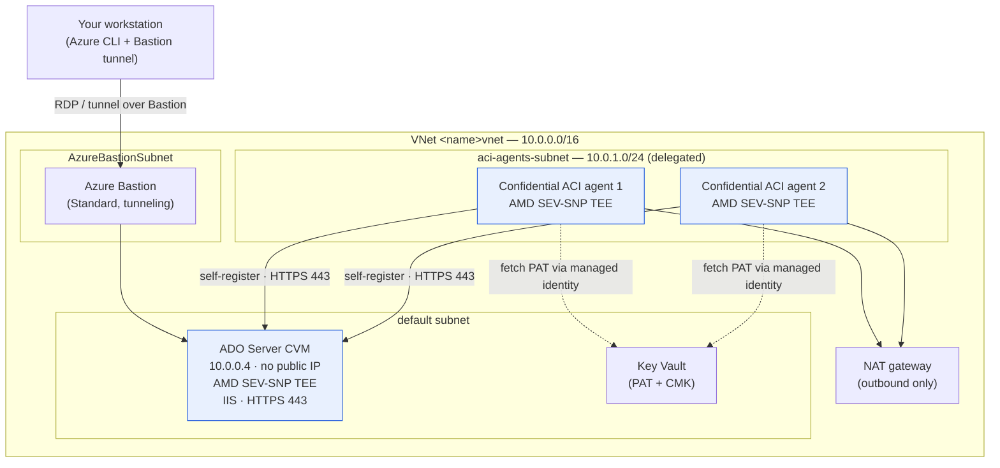
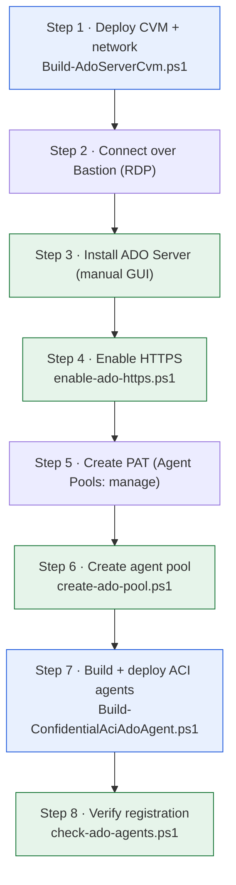
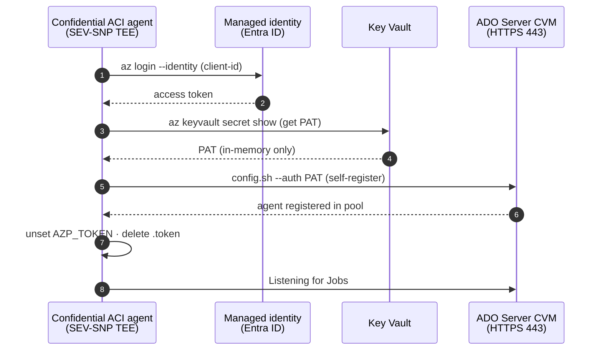

# Azure DevOps Server on a Confidential VM, with Confidential ACI build agents

Stand up a private **Azure DevOps (ADO) Server** on a **Confidential VM (CVM)**, reachable
only over a private VNet through Azure Bastion, plus **confidential Azure Container Instances
(ACI) build agents** that self-register to it over that private network.

Both the server *and* the build agents run inside AMD SEV-SNP confidential hardware, and no
component is exposed to the public internet.

## Why this pattern matters

Azure already encrypts data at rest and in transit, and Azure Confidential Computing (ACC)
helps protect **data in use** by processing it inside a hardware-based, attested Trusted
Execution Environment (TEE). On a Confidential VM or confidential container this protection is
**transparent to the software running inside** — the application doesn't need to be
"ACC-aware" to benefit. The real gap is on the platform side: **not every Azure PaaS and SaaS
service offers a confidential option yet.** So if the managed service you'd normally reach for
doesn't have an ACC-backed tier, you can be left without a way to help protect that workload's
data while it's in use.

This example shows a **lift-and-shift pattern** for closing that gap. Instead of waiting for a
managed service to add confidential support, you host the unmodified application yourself on a
**Confidential VM** and run its workloads on **confidential containers**, wrapping it in ACC
hardware protections. The result is **end-to-end confidentiality** — the customer owns the
confidentiality of their **data, code, and applications**. When ACC is enabled and properly
configured with customer-managed keys and verification policies, it is designed to help
prevent unauthorized access to data in use, including from the cloud operator.

**When to use this pattern**

- The Azure PaaS/SaaS service you'd use doesn't (yet) offer a confidential option but there is a compatible or equivalent service you can install into a virtual machine.
- You want full ownership and control of the confidentiality boundary end-to-end.
- Regulatory or contractual obligations call for data to stay protected even while in use.

> ACC provides *even more robust* protection for data in use; it is not a replacement for
> Azure's existing security. Its confidentiality guarantees depend on the customer correctly
> configuring customer-managed keys and attestation/verification policies. ACC is not
> available in all geographies and does not apply to every workload.

**The trade-off.** With a managed PaaS/SaaS service, confidentiality (where available),
patching, and upgrades "just happen." This self-hosted pattern hands that responsibility back
to you: you are responsible for maintaining, patching, updating, and upgrading the VM, the
application, the container images, and the attestation configuration over time. You gain ACC
coverage for workloads that would otherwise have none — in exchange for the operational
overhead of running it yourself.

## Architecture

```
        Your workstation
              │  (Azure CLI + Bastion tunnel — no public IP on the server)
              ▼
   ┌───────────────────────────────────────────────┐
   │  VNet  <name>vnet  (10.0.0.0/16)               │
   │                                                │
   │   AzureBastionSubnet ── Bastion (Standard)     │
   │                                                │
   │   default subnet                               │
   │     └─ ADO Server CVM  (10.0.0.4, no PIP)      │
   │          IIS "Azure DevOps Server", HTTPS 443  │
   │                                                │
   │   aci-agents-subnet (10.0.1.0/24, delegated)   │
   │     ├─ Confidential ACI agent 1 ──┐            │
   │     └─ Confidential ACI agent 2 ──┤ self-      │
   │                                   │ register   │
   │            NAT gateway (egress) ──┘ via HTTPS  │
   └───────────────────────────────────────────────┘
```

The same topology as a rendered diagram — everything stays inside the VNet, and only
outbound HTTPS leaves through the NAT gateway:



> **Hybrid option — keep the ADO Server on-premises.** This sample runs the Azure
> DevOps Server and its database on an Azure Confidential VM, but that's not a
> requirement. The **ADO Server and its SQL database can instead live in your own
> on-premises datacenter** and still drive the **confidential ACI build agents** in
> Azure — as long as the on-prem network is connected to this Azure VNet over
> **ExpressRoute** or a **site-to-site / VPN gateway**. The agents self-register to
> the server over that private path exactly as they do here, so you keep your
> existing on-prem ADO investment while gaining attested, confidential build
> compute in the cloud. (In that topology the CVM in the diagram is replaced by
> your on-prem server reachable across the ExpressRoute/VPN link.)

### How data is protected — at rest, in transit, and in use

The pattern covers all three data states across both tiers. The ADO Server is a
**Confidential VM** and the build runners are **confidential ACI**, so both get
hardware-based memory encryption (data **in use**) on top of the usual at-rest
and in-transit protections:

| Data state | ADO Server (Confidential VM) | Build runners (confidential ACI) |
| --- | --- | --- |
| **At rest** | OS and data disks encrypted with a **customer-managed key (CMK)** in Key Vault; the SQL database (repos, work items, pipeline metadata) lives on those encrypted disks. VM guest state is protected by confidential OS-disk encryption bound to the vTPM. | Container **scratch/overlay is encrypted** — the CCE policy enforces `allow_unencrypted_scratch = false`, so source checkout, package cache, and build artifacts under `/azp/_work` are encrypted on the ephemeral volume. Base image layers are integrity-pinned via dm-verity. |
| **In transit** | All access is over the **private VNet** (no public IP); admin reaches it only through **Azure Bastion** (TLS-tunnelled RDP). ADO web/REST is served over **HTTPS 443**. Egress leaves via NAT gateway only. | Agents **self-register and poll over HTTPS 443** to the server across the private VNet. PAT is fetched from Key Vault over TLS; secrets/artifacts pushed to ADO/ACR travel over HTTPS. No inbound exposure. |
| **In use** | **AMD SEV-SNP** encrypts VM memory with a per-VM key the host/hypervisor can't read; boot integrity is attested (vTPM + guest attestation). Data being processed in RAM is protected from the cloud operator. | **AMD SEV-SNP** encrypts container memory; the workload is **attested against the CCE policy** before it starts. In-flight source, secrets, and artifacts in RAM stay confidential, and **no exec/stdio** means the operator can't read live build state. |

> Because the registration PAT is retrieved at runtime from Key Vault **inside the
> TEE** (see Step 7), the credential itself is only ever present in encrypted
> memory on the runner — it isn't written to the ARM template, the image, or the
> container's environment.

## Prerequisites

- **Azure CLI** signed in to the target subscription:
  ```powershell
  az login
  az account set --subscription <subscription-id>
  ```
- **Bastion CLI extension** (for native RDP/tunnel over Bastion):
  ```powershell
  az extension add --name bastion
  ```
- **Docker** running locally (used to build and push the agent image to ACR).
- The **Azure DevOps Server installer** `.exe` (you supply this — for example
  `Azure DevOps Server`). Download it from the
  [Azure DevOps Server download page](https://learn.microsoft.com/en-us/azure/devops/server/download/azuredevopsserver?view=azure-devops);
  grab the **latest release** for current security and platform fixes.
- Quota for the confidential VM size (default `Standard_DC8as_v5`) in your region.

Throughout this guide, replace the placeholders:

| Placeholder | Meaning | Reference example |
| --- | --- | --- |
| `<subscription-id>` | Azure subscription GUID | `00000000-0000-0000-0000-000000000000` |
| `<name>` | Base name for the CVM / resource group | `myado` |
| `<resource-group>` | Resource group (equals `<name>`) | `MYADO` |
| `<vm-name>` | VM name (equals `<name>`) | `myado` |
| `<vnet-name>` | VNet name (`<name>vnet`) | `myadovnet` |
| `<acr-name>` | Azure Container Registry name | `myadoacr` |
| `<your-pat>` | ADO personal access token | — |

---

## End-to-end installation

The eight steps below move from an empty subscription to confidential build agents
registered and ready. Blue steps run **on your workstation**; green steps run **on the
CVM** (through `az vm run-command` or an RDP session):



### Step 1 — Deploy the Confidential VM and network

Creates the resource group, the CVM (no public IP), the VNet with the delegated
`aci-agents-subnet` and a NAT gateway for egress, and a **Standard-SKU Bastion** with
native-client tunneling enabled.

```powershell
cd usecase-ado-server-iaas
.\Build-AdoServerCvm.ps1 `
  -subsID <subscription-id> `
  -basename <name> `
  -region northeurope `
  -vmsize Standard_DC8as_v5
```

The script prints the resource group, VM name, and Bastion name at the end. By convention:

- Resource group / VM name: `<name>` (e.g. `myado`)
- VNet: `<name>vnet` (e.g. `myadovnet`)
- Bastion: `<name>vnet-bastion` (e.g. `myadovnet-bastion`)
- Private IP of the CVM: `10.0.0.4`

### Step 2 — Connect to the CVM over Bastion (RDP)

The CVM has **no public IP**, so open its Windows desktop through Bastion. Capture the VM
resource ID once, then start the RDP session:

```powershell
$vmId = az vm show -g <resource-group> -n <vm-name> --query id -o tsv
az network bastion rdp `
  --name <vnet-name>-bastion `
  --resource-group <resource-group> `
  --target-resource-id $vmId
```

See [Connecting via Bastion](#connecting-via-bastion) for the browser/tunnel alternative.

### Step 3 — Install Azure DevOps Server manually (simplest path)

Do this **inside the RDP session** on the CVM. This is the plain, GUI-driven install using
SQL Server Express, default options, and **no Search** (Search needs a separate Elasticsearch
component and is not required for build agents).

1. **Copy the installer onto the VM.** Drag the ADO Server `.exe` through the RDP session (or
   paste via the RDP clipboard) into `C:\Install\`.

2. **Run the installer.** Double-click the `.exe`, accept the license terms, and click
   **Install**. This lays down the product bits and then launches the **Server Configuration
   Wizard**. (If the wizard does not start automatically, open a Start-menu search for
   *Azure DevOps Server Administration Console* and choose **Configure Installed Features →
   Configure**.)

3. **Choose the configuration type.** Select **Basic** (or **New deployment → Basic**). Basic
   is the simplest topology: it configures the app tier plus a local database and skips
   reporting and advanced options.

4. **Database — use SQL Server Express.** When prompted for the SQL Server instance, choose
   the option to **install SQL Server Express** (the wizard offers to download/install it
   automatically). Leave the instance name at the default. Do **not** point at an external SQL
   Server for this demo.

5. **Do NOT enable Search.** On the Search step, **uncheck / skip "Configure Search"** (also
   called *Code Search* / *Elasticsearch*). It is optional and unnecessary for running build
   agents.

6. **Accept all remaining defaults.** Keep the default:
   - Project collection name: **`DefaultCollection`**
   - Service account: **`NT AUTHORITY\NETWORK SERVICE`**
   - Website / IIS binding: default **HTTP on port 80** (site name **"Azure DevOps Server"**)
   - Application tier public URL: leave as generated

7. **Run readiness checks and configure.** Click **Verify**, then **Configure**. When it
   finishes, the console shows the collection URL, e.g. `http://<vm-name>/DefaultCollection`.

8. **Confirm it is up.** In the VM's browser, open `http://localhost/DefaultCollection` — you
   should see the Azure DevOps web UI.

> The install runs entirely on the VM over its default HTTP binding. HTTPS is added in the
> next step because the build agents refuse PAT auth over plain HTTP.

### Step 4 — Enable HTTPS on the ADO Server

The build agents authenticate with a PAT, and the agent **refuses PAT/Basic auth over plain
HTTP** — so HTTPS is required. Run this **from your workstation** (it executes on the VM as
SYSTEM via run-command); it creates a self-signed certificate (CN=`10.0.0.4`), binds 443, and
opens the firewall:

```powershell
az vm run-command invoke -g <resource-group> -n <vm-name> `
  --command-id RunPowerShellScript `
  --scripts "@usecase-ado-server-iaas/enable-ado-https.ps1"
```

### Step 5 — Create a Personal Access Token (PAT)

Open a Bastion tunnel to the ADO web UI, then create a PAT with **Agent Pools (read,
manage)** scope:

```powershell
az network bastion tunnel `
  --name <vnet-name>-bastion `
  --resource-group <resource-group> `
  --target-resource-id $vmId `
  --resource-port 443 `
  --port 8443
```

Leave that terminal open and browse to `https://localhost:8443/DefaultCollection` (accept the
self-signed certificate warning). Go to **User settings → Personal access tokens → New
Token**, grant **Agent Pools (read, manage)**, and copy the token. Store it in the current
shell (do **not** commit it):

```powershell
$env:AZP_TOKEN = '<your-pat>'
```

### Step 6 — Create the confidential build agent pool

Create the `confidential-build-pool` on the server (runs on the VM against `localhost`):

```powershell
az vm run-command invoke -g <resource-group> -n <vm-name> `
  --command-id RunPowerShellScript `
  --scripts "@usecase-ado-server-iaas/create-ado-pool.ps1" `
  --parameters "Pool=confidential-build-pool" "Pat=$env:AZP_TOKEN" `
  --query "value[0].message" -o tsv
```

Note the pool `id` from the output (`POOL-CREATED` / `POOL-EXISTS` — typically `id=2`); you
use it to verify agents in Step 8.

> **Why the script targets the collection, not the deployment root.** On Azure DevOps
> Server the PAT authenticates at the **collection** host, so the agent-pool REST API must be
> called through the collection path
> (`http://localhost/DefaultCollection/_apis/distributedtask/pools`). Calling the bare
> deployment root (`http://localhost/_apis/...`) returns **401** even with a valid PAT.
> `create-ado-pool.ps1` builds its base URL from the collection (default `DefaultCollection`,
> override with `Collection=<name>`); if you see `POOL-CREATED`/`POOL-EXISTS` the PAT and
> scope are correct.

### Step 7 — Build and deploy the confidential ACI agents

Builds the agent container image, pushes it to ACR, and deploys the confidential ACI agents
into `aci-agents-subnet`. They self-register to the pool over the private VNet. The PAT is
read from `$env:AZP_TOKEN`:

```powershell
.\Build-ConfidentialAciAdoAgent.ps1 `
  -SubscriptionId <subscription-id> `
  -ResourceGroupName <resource-group> `
  -Prefix <name> `
  -AzpUrl 'https://10.0.0.4/DefaultCollection' `
  -AzpPool 'confidential-build-pool' `
  -AcrName <acr-name> `
  -AgentCount 2 `
  -VnetName '<vnet-name>' `
  -AgentSubnetName 'aci-agents-subnet'
```

In this mode the PAT is passed to the deployment as an ARM `securestring` and injected into
the container as the `AZP_TOKEN` environment variable. It is protected in transit, but it does
land in the deployment's parameter values. For a stronger posture, keep the PAT out of the
template entirely and have each agent fetch it at runtime from Key Vault — see below.

#### Key Vault-backed PAT retrieval (recommended)

Instead of handing the PAT to the ARM deployment, store it once in the CVM's **Key Vault** and
let each confidential agent fetch it **at runtime, from inside the SEV-SNP TEE**, using its
**user-assigned managed identity**. With this option:

- The PAT never appears in the container image, the ARM template, the deployment history, or
  the container's environment variables. Only the (non-secret) vault name, secret name, and
  managed-identity client ID are passed to the deployment.
- The token materializes **only in-memory inside the attested TEE**, is written to a
  short-lived `/azp/.token` file for `config.sh`, and the environment variable is unset
  immediately after.
- Access is least-privilege: the managed identity is granted only `get` on the secret (RBAC
  role **Key Vault Secrets User** on RBAC-enabled vaults, or a `get`-only access policy on
  classic vaults).

Prerequisites:

1. A **user-assigned managed identity** for the agents (create one, or reuse an existing one),
   and its resource ID.
2. A **Key Vault** the agents can reach over the private VNet (the CVM build already
   provisions one for CMK disk encryption — you can reuse it).

Deploy with `-KeyVaultName` and `-UserAssignedIdentityResourceId`. Use `-StorePatInKeyVault`
to seed the secret from `$env:AZP_TOKEN` on the first run (the script also grants the identity
`get` access automatically):

```powershell
.\Build-ConfidentialAciAdoAgent.ps1 `
  -SubscriptionId <subscription-id> `
  -ResourceGroupName <resource-group> `
  -Prefix <name> `
  -AzpUrl 'https://10.0.0.4/DefaultCollection' `
  -AzpPool 'confidential-build-pool' `
  -AcrName <acr-name> `
  -AgentCount 2 `
  -VnetName '<vnet-name>' `
  -AgentSubnetName 'aci-agents-subnet' `
  -UserAssignedIdentityResourceId '<managed-identity-resource-id>' `
  -KeyVaultName '<key-vault-name>' `
  -PatSecretName 'ado-agent-pat' `
  -StorePatInKeyVault
```

On subsequent runs, drop `-StorePatInKeyVault` (and you no longer need `$env:AZP_TOKEN` set) —
the agents read the existing secret straight from the vault:

```powershell
.\Build-ConfidentialAciAdoAgent.ps1 `
  -SubscriptionId <subscription-id> `
  -ResourceGroupName <resource-group> `
  -Prefix <name> `
  -AzpUrl 'https://10.0.0.4/DefaultCollection' `
  -AzpPool 'confidential-build-pool' `
  -AcrName <acr-name> `
  -AgentCount 2 `
  -VnetName '<vnet-name>' `
  -AgentSubnetName 'aci-agents-subnet' `
  -UserAssignedIdentityResourceId '<managed-identity-resource-id>' `
  -KeyVaultName '<key-vault-name>' `
  -PatSecretName 'ado-agent-pat'
```

At startup the agent's entrypoint runs `az login --identity` with its assigned identity, calls
`az keyvault secret show` to read the PAT, registers with `config.sh`, and clears the token
from memory. Because this only changes how the PAT is *acquired* (not what runs), the agent
image and CCE policy are still produced exactly as in the default flow.

The PAT never touches the ARM template or the container environment — it materializes only
in-memory inside the attested TEE:



> **Rotation tip.** Treat the registration PAT as short-lived: use a narrowly-scoped
> **Agent Pools (read, manage)** token, and rotate it in Key Vault
> (`az keyvault secret set`) after the agents are registered. Existing agents keep running on
> their established connection; a new PAT is only needed for re-registration.

> **Agent image prerequisites — bake in the Azure CLI.** The sample pipeline
> ([`pipelines/secretapp-helloworld`](pipelines/secretapp-helloworld/README.md))
> calls `az` **on the agent** (`az login --identity`, `az acr build`,
> `az deployment group create`). The default agent Dockerfile in
> `Build-ConfidentialAciAdoAgent.ps1` is `ubuntu:22.04` with only
> `curl`/`git`/`jq`, so a pipeline run fails with `az: command not found`.
> The container also runs as the non-root user `azp`, so installing `az` at
> pipeline runtime is not viable — it must be part of the image. Add the Azure
> CLI to the Dockerfile before building, e.g.:
>
> ```dockerfile
> RUN curl -sL https://aka.ms/InstallAzureCLIDeb | bash
> ```
>
> Because the agents run as **Confidential** ACI, rebuilding the image changes
> the measured layers, so the CCE policy is regenerated and both agents are
> redeployed as part of re-running this step.

#### Alternative — run the agents on AKS virtual nodes

`Build-ConfidentialAciAdoAgent.ps1` deploys each runner as a standalone
confidential ACI container group. If you would rather manage the runners as a
Kubernetes workload — for example to scale them with `kubectl` or run them
alongside other AKS services — use **`Build-AksVirtualNodesAdoAgent.ps1`**
instead. It builds the same self-registering agent image but schedules the pods
onto an **AKS virtual node** backed by confidential ACI (AMD SEV-SNP via the
`virtual-kubelet.io/confidential-compute-cce-policy` annotation). The
confidentiality guarantee is identical — it comes from the ACI CCE policy on the
virtual-node container group, so a standard AKS system node pool is enough to
host the virtual node.

```powershell
.\Build-AksVirtualNodesAdoAgent.ps1 `
  -SubscriptionId <subscription-id> `
  -ResourceGroupName <resource-group> `
  -Prefix <name> `
  -VnetName '<vnet-name>' `
  -AzpUrl 'https://10.0.0.4/DefaultCollection' `
  -AzpPool 'confidential-build-pool' `
  -AgentCount 2 `
  -PolicyMode generated
```

- **`-PolicyMode generated` is the default** on current confidential UVMs. It
  runs `az confcom acipolicygen --virtual-node-yaml` to produce a restrictive,
  image-bound CCE policy — the same hardening basis as the
  [`aci-samples/sealed-container`](../aci-samples/sealed-container/README.md)
  demo (pinned image digest + per-layer dm-verity hashes, no `exec_processes`,
  no stdio). The `debug-allow-all` shortcut is opt-in for plumbing validation
  only: it runs the pod as confidential ACI but **does not block `exec`/stdio**,
  so never trust a `debug-allow-all` runner with secrets.
- **The script verifies the live policy after rollout.** Once the agents are
  running it reads `confidentialComputeProperties.ccePolicy` back off each
  backing container group and, in `generated` mode, **fails the deployment if
  the policy is permissive** (allow-all, `exec_external` allowed, `allow_stdio_access:true`,
  or a tiny stub with no layer hashes). This gate exists because a Confidential
  SKU alone does not guarantee enforcement — a debug policy still lets an
  operator open a terminal in the runner.
- `acipolicygen` hashes the image through the **local Docker daemon**, so run
  `az acr login --name <acr-name>` and `docker pull <image>` **first** — otherwise
  the policy step fails with a registry `401` while "Pulling and hashing images".
- On reruns add `-SkipAksCreate -SkipImageBuild` to redeploy only the agent
  workload against the existing cluster and image.

The runners self-register into the same pool and appear identically in Step 8 and
in the ADO web UI (as `SandboxHost-*` agents).

**Prove that terminal access is blocked.** Under `-PolicyMode generated` the CCE
policy has no `exec_processes` entry, so the ACI control plane refuses any exec
request — the same check the sealed-container demo performs:

```powershell
$nodeRg = "MC_<rg>_<aks-name>_<location>"           # AKS node resource group
$cg = az container list -g $nodeRg --query "[0].name" -o tsv
az container exec -g $nodeRg -n $cg --exec-command /bin/sh
# ^ Expect a refusal. If a shell opens, the runner is on a debug/allow-all
#   policy and must NOT be trusted with secrets — redeploy with -PolicyMode generated.

# Inspect the live policy directly (a real policy is many KB with layer hashes;
# a ~700-byte policy containing 'allow_all := true' or 'exec_external ... allowed:true'
# is the permissive debug stub):
az container show -g $nodeRg -n $cg --query confidentialComputeProperties.ccePolicy -o tsv |
  ForEach-Object { [Text.Encoding]::UTF8.GetString([Convert]::FromBase64String($_)) }
```


#### Confidential Enforcement (CCE) policy — protecting artifacts while they are built

Each agent is deployed as **Confidential** ACI with an auto-generated **CCE
(Confidential Enforcement) policy**. The script produces it with
`az confcom acipolicygen ... --disable-stdio --approve-wildcards`
(see [`Build-ConfidentialAciAdoAgent.ps1`](Build-ConfidentialAciAdoAgent.ps1)),
and the AMD SEV-SNP hardware measures and enforces it at launch. This is what
keeps the **source, dependencies, intermediate objects, and finished build
artifacts confidential and tamper-resistant *while they are being fetched,
compiled, packaged, and signed*** — the window where a build normally exposes
plaintext code and secrets to the host. The policy pins exactly what may run and
closes the usual operator escape hatches:

Beyond confidentiality, the policy protects the **integrity** of those artifacts
by making the build environment tamper-evident and tamper-resistant. Because the
image and its filesystem layers are cryptographically measured (dm-verity) and
attested before any code runs, and because no one can exec in, stream stdio, or
inject processes/environment into a running job, an attacker or even the cloud
operator cannot silently alter the toolchain, swap dependencies, or modify the
compiled output in flight. Any such tampering changes the measurements and fails
attestation, so the container simply never starts — giving you strong assurance
that the artifacts that come out are exactly the ones your trusted pipeline
produced.

| Policy setting | Value | What it enforces during a build |
| --- | --- | --- |
| **Image + layer hashes** | pinned (dm-verity) | Only the exact, measured agent image can run; a swapped or tampered image fails attestation and never starts, so builds can't be hijacked by a modified toolchain. |
| **`command`** | locked to `./start.sh` | The container can only launch the agent entrypoint — no alternate binary or injected startup command. |
| **`exec_processes`** | `[]` (empty) — **no exec** | Nobody (including the cloud operator) can `az container exec` / shell into a running build to read or alter source, secrets, or artifacts in flight. |
| **`allow_stdio_access`** | `false` — **no stdio** | Console stdout/stderr can't be streamed off the container, so build logs and any secrets they might print stay inside the TEE. |
| **`signals`** | `[]` | No arbitrary signals to build processes (no external pause/kill to manipulate a running job). |
| **`allow_elevated`** | `false` | Builds run unprivileged — no privileged escalation from inside the container. |
| **`allow_unencrypted_scratch`** | `false` | The scratch/temp filesystem where code is checked out and compiled is **encrypted**, protecting intermediate build state at rest. |
| **`env_rules`** | strict allow-list | Only the expected `AZP_*` / identity variables are accepted; unexpected environment injection is rejected. |
| **`allow_dump_stacks` / `allow_runtime_logging`** | `false` | Process stack dumps and runtime logging that could leak in-memory build data are blocked. |

Because the PAT is fetched at runtime from Key Vault inside the TEE (see above),
it isn't part of the measured environment either — so neither the build inputs,
the credentials, nor the produced artifacts are exposed to the host while the
job runs. You can inspect the live policy on a running agent with:

```powershell
az container show --resource-group <resource-group> --name <prefix>-caci-agent-1 `
  --query "confidentialComputeProperties.ccePolicy" -o tsv |
  ForEach-Object { [System.Text.Encoding]::UTF8.GetString([Convert]::FromBase64String($_)) }
```

### Step 8 — Verify the agents registered

```powershell
az vm run-command invoke -g <resource-group> -n <vm-name> `
  --command-id RunPowerShellScript `
  --scripts "@usecase-ado-server-iaas/check-ado-agents.ps1" `
  --parameters "PoolId=2" "Pat=$env:AZP_TOKEN" `
  --query "value[0].message" -o tsv
```

You should see `AGENT-COUNT 2` with each agent `status=online`. The platform is now ready:
queue a pipeline against `confidential-build-pool` and it runs on a confidential agent.

> The agent names are the **confidential container hostnames** (for example
> `SandboxHost-639203230470841966`), not the CVM or Kubernetes pod name — that is
> expected. Each SEV-SNP runner reports the sandbox host it booted inside.

#### See the runners in the Azure DevOps web UI

With the Bastion tunnel from Step 5 still open (`https://localhost:8443`), you can
watch the same agents come online in the browser:

1. Browse to the agent-pools admin page:
   **`https://localhost:8443/_settings/agentpools`**
   (or click the **gear / Collection Settings → Pipelines → Agent pools**). Accept
   the self-signed-certificate warning if prompted.
2. Select **`confidential-build-pool`**, then open the **Agents** tab.
3. Each confidential runner appears as a **`SandboxHost-<id>`** entry with a green
   **Online** status. Selecting an agent shows its version and capabilities.

> If the tunnel has closed, reopen it with the `az network bastion tunnel`
> command from [Step 5](#step-5--create-a-personal-access-token-pat) (or
> [Option B](#option-b--reach-the-ado-web-ui--rest-api-from-your-browser-tunnel)).
> To manage the pool from inside the VM instead, open
> `https://localhost/_settings/agentpools` in the CVM's browser over RDP.

---

## Connecting via Bastion

The CVM has **no public IP**. All access goes through Azure Bastion (Standard SKU with
`--enable-tunneling` and `--enable-ip-connect`), so you connect from your workstation
without exposing the server to the internet. Capture the VM resource ID once for reuse:

```powershell
$vmId = az vm show -g <resource-group> -n <vm-name> --query id -o tsv
```

### Option A — Full desktop (RDP)

Opens the Windows desktop of the CVM through Bastion using your local RDP client. Use
this to run the installer, manage IIS, or use the ADO web UI from inside the box.

```powershell
az network bastion rdp `
  --name <vnet-name>-bastion `
  --resource-group <resource-group> `
  --target-resource-id $vmId
```

> Native RDP over Bastion is Windows-only and requires the Standard Bastion SKU (already
> configured by `Build-AdoServerCvm.ps1`).

### Option B — Reach the ADO web UI / REST API from your browser (tunnel)

Forwards a local port to the CVM's HTTPS port through Bastion, so you can browse the
Azure DevOps collection or call its REST API from your workstation — no desktop needed.

```powershell
az network bastion tunnel `
  --name <vnet-name>-bastion `
  --resource-group <resource-group> `
  --target-resource-id $vmId `
  --resource-port 443 `
  --port 8443
```

Leave that terminal open, then in a browser go to:

```
https://localhost:8443/DefaultCollection
```

The ADO Server uses a self-signed certificate, so your browser will warn about the
certificate — that is expected; proceed past the warning. To tunnel plain HTTP instead,
use `--resource-port 80` and browse `http://localhost:8443/DefaultCollection`.

---

## Repository layout

### Core scripts (run these directly, in order)

| Script | Where it runs | Purpose |
| --- | --- | --- |
| `Build-AdoServerCvm.ps1` | Workstation | Deploy the CVM, VNet, subnets, NAT gateway, and Standard Bastion (Step 1). |
| `enable-ado-https.ps1` | On the CVM (via run-command) | Create self-signed cert, bind 443, open firewall (Step 4). |
| `create-ado-pool.ps1` | On the CVM (via run-command) | Create the confidential build agent pool (Step 6). |
| `Build-ConfidentialAciAdoAgent.ps1` | Workstation | Build/push the agent image and deploy confidential ACI agents (Step 7). |
| `Build-AksVirtualNodesAdoAgent.ps1` | Workstation | Alternative to Step 7 — deploy the same agents as confidential ACI on AKS virtual nodes. |
| `check-ado-agents.ps1` | On the CVM (via run-command) | List agents registered in a pool to verify registration (Step 8). |

> Installing Azure DevOps Server itself is a **manual** step (Step 3) — see
> [Step 3 — Install Azure DevOps Server manually](#step-3--install-azure-devops-server-manually-simplest-path).

### Supporting files and advanced options

| File | Purpose |
| --- | --- |
| `ado-agent-virtualnode.yaml` | Kubernetes Deployment manifest template used by `Build-AksVirtualNodesAdoAgent.ps1` to schedule the agent pods onto the AKS virtual node. |
| `skr-pat.py` | Attestation-gated **Secure Key Release (SKR)** helper — releases the registration PAT only after the runner's SEV-SNP report is verified, so the token never exists outside an attested TEE. |
| `pim-activate-owner.ps1` | Self-activates an eligible **PIM** Owner role (needed to grant the Key Vault data-plane roles the SKR flow requires). |
| `wait-for-rbac.ps1` | Retry loop that waits for a freshly-granted role assignment to propagate before continuing an unattended deploy. |
| `pipelines/` | Sample pipelines that run **on** the confidential agents — `secretapp-helloworld`, `visual-attestation-demo`, and `sample-app-deployment` (deploys visual-attestation v2 to confidential ACI). See each folder's README. |

### `helper-scripts/` (diagnostics, cleanup, and superseded automation)

These are **not** part of the main flow — they are troubleshooting/maintenance aids and the
earlier (unreliable) install-automation attempts kept for reference. Most run on the CVM via
`az vm run-command invoke --scripts "@usecase-ado-server-iaas/helper-scripts/<name>"`.

| Script | Purpose |
| --- | --- |
| `Install-AdoServerOneShot.ps1` | Original unattended ADO Server installer (SQL Express, HTTP). Superseded by the manual install in Step 3; kept for reference. |
| `Run-Install-AdoServerOneShot.ps1` | Convenience wrapper that calls `Install-AdoServerOneShot.ps1` with defaults. |
| `discover-ado.ps1` | Probe local ADO endpoints, project collections, and TFS registry config on the CVM. |
| `list-iis-sites.ps1` | List IIS sites and bindings on the CVM (confirm the "Azure DevOps Server" site). |
| `diag-cvm-network.ps1` | Check port 80/443 listeners, firewall rules, and local HTTP reachability on the CVM. |
| `check-agent-package.ps1` | Verify the build-agent package download/URL is reachable from the server. |
| `remove-stale-agents-v2.ps1` | Remove agents from a pool by name pattern (current cleanup helper). |
| `remove-stale-agents.ps1` | Earlier version of the cleanup helper (has a URI-parse bug; superseded by v2). |
| `agent-test.template.yaml` | Throwaway ACI template used to reproduce/debug agent registration issues. |
| `net-test.yaml` | Throwaway ACI template for testing VNet/network connectivity from a container. |

---

## Cleanup

Delete the whole deployment by removing its resource group:

```powershell
az group delete --name <resource-group> --yes --no-wait
```

To remove only the agents (keep the server), use the cleanup helper:

```powershell
az vm run-command invoke -g <resource-group> -n <vm-name> `
  --command-id RunPowerShellScript `
  --scripts "@usecase-ado-server-iaas/helper-scripts/remove-stale-agents-v2.ps1" `
  --parameters "PoolId=2" "NamePattern=<name>-agent" "Pat=$env:AZP_TOKEN" `
  --query "value[0].message" -o tsv
```