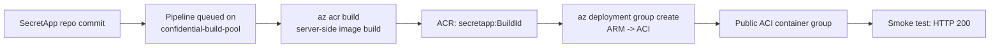

# SecretApp — hello-world container to ACI, driven entirely inside Azure DevOps

This folder is a self-contained pipeline scaffold. Drop it into your **SecretApp**
Azure DevOps repo (or reference it from this repo) to build a minimal hello-world
container and deploy it to **Azure Container Instances (ACI)** — with every step
running **inside ADO** on the self-hosted confidential build agents.

Nothing runs on your laptop: the image is built server-side with `az acr build`
(so the dockerless confidential ACI agents can do it) and deployed with an ARM
template.

## What gets created

| File | Purpose |
| --- | --- |
| `app/Dockerfile` | Minimal `nginx:alpine` image serving a static page. |
| `app/index.html` | The hello-world page. |
| `deploy/aci-helloworld.json` | ARM template that creates a public ACI container group. |
| `azure-pipelines.yml` | Two-stage pipeline: **Build** (`az acr build`) → **Deploy** (`az deployment group create`) + smoke test. |

## Flow



## One-time setup in Azure DevOps

1. **Agent pool** — confirm the `confidential-build-pool` pool exists with at
   least one online confidential ACI agent. (Provisioned by the parent
   `usecase-ado-server-iaas` guide.)

   > **The agent image must include the Azure CLI.** The pipeline calls `az`
   > directly on the agent (`az login --identity`, `az acr build`,
   > `az deployment group create`). The default confidential agent image
   > (`ubuntu:22.04` + `curl`/`git`/`jq`) does **not** ship `az`, so a run fails
   > with `az: command not found`. Bake `azure-cli` into the agent image before
   > first use — see *Agent image prerequisites* in the parent
   > [`usecase-ado-server-iaas` guide](../../README.md). Rebuilding the image
   > also regenerates the CCE policy, so the agents must be redeployed.

2. **Azure Container Registry** — a Basic (or higher) ACR with the **admin user
   enabled**:
   ```bash
   az acr update -n <acr-name> --admin-enabled true
   ```

3. **ARM service connection** — Project Settings → Service connections → New →
   **Azure Resource Manager**. Give it Contributor on the resource group that
   holds the ACR and will hold the ACI. Note its **name**.

   > **Tenant-restricted environments.** Some tenants block ad-hoc service
   > principal creation (app registrations require a *Service Tree ID* /
   > `ServiceManagementReference`), and some accounts have **Contributor but not
   > User Access Administrator**, so they cannot create role assignments. In that
   > case the automatic "Azure Resource Manager → Service principal" flow fails.
   > Options, cleanest first:
   >
   > - **Managed-identity service connection.** Attach a **user-assigned managed
   >   identity (UAMI)** to the build agents (a plain Azure resource — usually
   >   *not* tenant-blocked), have an admin grant that UAMI **Contributor** on the
   >   resource group, then create an **Azure Resource Manager → Managed identity**
   >   service connection. No secret, no app registration. (Attaching a UAMI to
   >   ACI requires recreating the container group, and granting it a role
   >   requires User Access Administrator/Owner.)
   > - **Existing service principal.** If your team already has an app
   >   registration with rights on the resource group, create the service
   >   connection with its client id + secret (or certificate).
   > - **Supply a Service Tree ID.** Create the app registration with
   >   `az ad app create --service-management-reference <serviceTreeId>` first,
   >   then a standard service-principal service connection.
   >
   > All three require either an admin role grant or an existing credential —
   > they cannot be completed by a Contributor-only account alone.

4. **Create the pipeline** — Pipelines → New pipeline → Azure Repos Git →
   **SecretApp** → Existing Azure Pipelines YAML file →
   `azure-pipelines.yml` (this file, once copied into the repo).

5. **Pipeline variables** — Edit → Variables, add:

   | Variable | Example | Notes |
   | --- | --- | --- |
   | `azureServiceConnection` | `secretapp-arm` | Name from step 3. |
   | `acrName` | `<acr-name>` | Registry name, no `.azurecr.io`. |
   | `resourceGroup` | `<resource-group>` | Holds the ACR + ACI. |
   | `location` | `northeurope` | Any ACI-capable region. |

   Keep these as **variables**, not hardcoded — no secrets live in the YAML.
   The ACR password is fetched at deploy time and marked `issecret=true`.

6. **Run it** — Queue the pipeline.

   > **First-run authorization prompt.** The very first time a pipeline uses the
   > `confidential-build-pool` agent pool, ADO pauses the run with *"This
   > pipeline needs permission to access a resource"* (the agent pool). Open the
   > run, click **View** → **Permit** to authorize it. This is a one-time grant
   > per pipeline; subsequent runs start immediately.

   When it finishes, the Deploy stage log
   prints `App URL: http://<dns>.<region>.azurecontainer.io`.

## SKU note (Standard vs Confidential)

This pipeline defaults to the **Standard** ACI SKU, which needs only the `az`
CLI and works on the dockerless confidential build agents — provided the agent
image has `azure-cli` baked in (see the prerequisite note in step 1).

A **Confidential** ACI SKU requires a per-image CCE policy generated by
`az confcom acipolicygen`, which needs a Docker daemon. The confidential ACI
build agents don't run one, so:

- Keep `aciSku: Standard` to run fully inside ADO on these agents, **or**
- Select `Confidential` at queue time and run the pipeline on a Docker-capable
  agent (e.g. a Microsoft-hosted `ubuntu-latest` agent or a VM agent with
  Docker + the `confcom` extension), then extend the Deploy stage to run
  `az confcom acipolicygen` before deployment.

For a full confidential attestation walkthrough, see
[`aci-samples/visual-attestation-demo-v2`](../../../aci-samples/visual-attestation-demo-v2/README.md).

## Clean up

```bash
az container delete -g <resource-group> -n <container-group-name> --yes
```
