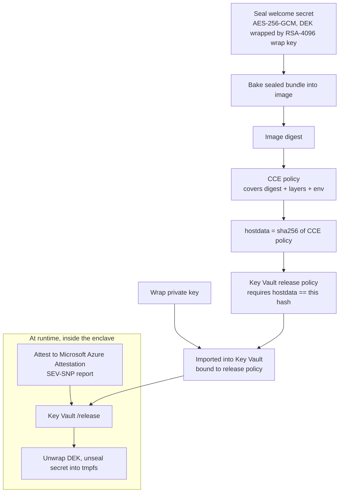
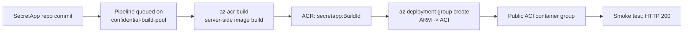

# SecretApp — container to ACI with attestation-gated Secure Key Release

This folder is a self-contained pipeline scaffold. Drop it into your **SecretApp**
Azure DevOps repo (or reference it from this repo) to build a container and deploy
it to **Azure Container Instances (ACI)** — with every step running **inside ADO**.

It has two modes, selected with the `aciSku` pipeline parameter:

- **Standard** — a plain hello-world container. The image is built server-side
  with `az acr build` (so the dockerless confidential ACI agents can do it) and
  deployed with an ARM template.
- **Confidential** — the same app, but its welcome secret is **sealed** and can
  only be **unsealed by the exact attested image running under the exact CCE
  policy on genuine AMD SEV-SNP hardware**, via Azure Key Vault **Secure Key
  Release (SKR)**. See [Trust model & Secure Key Release](#trust-model--secure-key-release).

## What gets created

| File | Purpose |
| --- | --- |
| `app/Dockerfile` | Multi-stage image: builds `get-snp-report`, then a Python app with the SKR entrypoint. |
| `app/entrypoint.py` | PID-1 Secure Key Release: attest to MAA → release the wrap key from Key Vault → unseal the secret into tmpfs, then hand off to the app. |
| `app/app.py` | Flask app that serves the unsealed welcome secret at `/api/sealed`. |
| `deploy/aci-helloworld.json` | ARM template for a **Standard** public ACI container group. |
| `deploy/aci-helloworld-confidential.json` | ARM template for a **Confidential** container group (CCE policy, UAMI identity, tmpfs mount, identity-based ACR pull — no admin creds). |
| `helper-scripts/Build-SecretAppSealed.ps1` | End-to-end SKR orchestrator: seal → build → CCE policy → import wrap key → deploy → smoke test. |
| `helper-scripts/skr-release-policy.json` | Template for the Key Vault release policy (binds `x-ms-sevsnpvm-hostdata` == sha256(CCE policy)). |
| `azure-pipelines.yml` | Two modes: **Standard** (build + deploy) and **Confidential** (orchestrator + CCE-hash verify gate + sealed smoke test). |

## Trust model & Secure Key Release

Running confidentially proves the *code ran in a TEE*. It does **not**, by
itself, stop a privileged operator from running a **different** image or an
**edited** policy and reading the app's secret. The Confidential mode closes that
gap: the secret is encrypted at build time and its decryption key is held in Key
Vault under a **release policy** that only a genuine enclave running *this exact*
image+policy can satisfy.

### How the binding works



Because the release policy is keyed off the CCE hash, which is keyed off the
image digest, which covers the sealed bundle — **only this exact image running
under this exact CCE policy on genuine SEV-SNP hardware can obtain the key.**

### What a malicious operator can and cannot do

| Attack | Result |
| --- | --- |
| Pull the image and run it **outside** a TEE | No valid SEV-SNP attestation → MAA issues no token → Key Vault refuses release. Secret never decrypts. |
| Run a **different / tampered** image in a TEE | Different image digest → different CCE hash → `hostdata` mismatch → release policy denied. |
| **Edit the CCE policy** (add a debug shell, change env) | Changes the policy hash → `hostdata` mismatch → release denied. The verify gate in the pipeline also fails the build. |
| Enable **debug** on the container | `x-ms-sevsnpvm-is-debuggable=true` violates the release policy → denied. |
| Read the image layers / registry bytes | Only the **sealed** (AES-GCM ciphertext) bundle is present; the wrap key lives only in Key Vault (HSM, non-exportable to the operator). |
| Read Key Vault directly with operator RBAC | The key is marked exportable **only via release** under the policy; a plain `get`/`download` returns no private material. |
| Swap the wrap key or its release policy | Requires `import` on the key; the pipeline separates that from who approves the CCE hash, and the verify gate re-checks the binding. |

## Flow

The **Standard** mode:



## One-time setup in Azure DevOps

1. **Agent pool** — confirm the `confidential-build-pool` pool exists with at
   least one online confidential ACI agent. (Provisioned by the parent
   `usecase-ado-server-iaas` guide.)

   > **The agent image must include the Azure CLI.** The pipeline calls `az`
   > directly on the agent (`az login --identity`, `az acr build`,
   > `az deployment group create`). The default confidential agent image
   > (`ubuntu:22.04` + `curl`/`git`/`jq`) does **not** ship `az`, so a run fails
   > with `az: command not found`. Bake `azure-cli` into the agent image before
   > first use — see *Agent image prerequisites* in the parent
   > [`usecase-ado-server-iaas` guide](../../README.md). Rebuilding the image
   > also regenerates the CCE policy, so the agents must be redeployed.

2. **Azure Container Registry** — a Basic (or higher) ACR with the **admin user
   enabled**:
   ```bash
   az acr update -n <acr-name> --admin-enabled true
   ```

3. **ARM service connection** — Project Settings → Service connections → New →
   **Azure Resource Manager**. Give it Contributor on the resource group that
   holds the ACR and will hold the ACI. Note its **name**.

   > **Tenant-restricted environments.** Some tenants block ad-hoc service
   > principal creation (app registrations require a *Service Tree ID* /
   > `ServiceManagementReference`), and some accounts have **Contributor but not
   > User Access Administrator**, so they cannot create role assignments. In that
   > case the automatic "Azure Resource Manager → Service principal" flow fails.
   > Options, cleanest first:
   >
   > - **Managed-identity service connection.** Attach a **user-assigned managed
   >   identity (UAMI)** to the build agents (a plain Azure resource — usually
   >   *not* tenant-blocked), have an admin grant that UAMI **Contributor** on the
   >   resource group, then create an **Azure Resource Manager → Managed identity**
   >   service connection. No secret, no app registration. (Attaching a UAMI to
   >   ACI requires recreating the container group, and granting it a role
   >   requires User Access Administrator/Owner.)
   > - **Existing service principal.** If your team already has an app
   >   registration with rights on the resource group, create the service
   >   connection with its client id + secret (or certificate).
   > - **Supply a Service Tree ID.** Create the app registration with
   >   `az ad app create --service-management-reference <serviceTreeId>` first,
   >   then a standard service-principal service connection.
   >
   > All three require either an admin role grant or an existing credential —
   > they cannot be completed by a Contributor-only account alone.

4. **Create the pipeline** — Pipelines → New pipeline → Azure Repos Git →
   **SecretApp** → Existing Azure Pipelines YAML file →
   `azure-pipelines.yml` (this file, once copied into the repo).

5. **Pipeline variables** — Edit → Variables, add:

   | Variable | Example | Notes |
   | --- | --- | --- |
   | `azureServiceConnection` | `secretapp-arm` | Name from step 3. |
   | `acrName` | `<acr-name>` | Registry name, no `.azurecr.io`. |
   | `resourceGroup` | `<resource-group>` | Holds the ACR + ACI (and Key Vault for Confidential). |
   | `location` | `northeurope` | Any ACI-capable region. |

   For the **Confidential** mode, also add:

   | Variable | Example | Notes |
   | --- | --- | --- |
   | `skrPool` | `docker-pool` | Agent pool with Docker + PowerShell 7 + `az` (needed by `acipolicygen`). |
   | `keyVaultName` | `<kv-name>` | Premium Key Vault (HSM, purge-protection) that holds the wrap key. |
   | `managedIdentityName` | `id-secretapp-pipeline` | User-assigned identity on the container group (AcrPull + KV get/release). |
   | `maaEndpoint` | `sharedneu.neu.attest.azure.net` | Microsoft Azure Attestation endpoint. |
   | `importerObjectId` | `<sp-object-id>` | Object ID of the service connection's service principal (granted get+import+delete on the wrap key). |
   | `containerGroupName` | `secretapp-cg` | Name for the confidential container group. |
   | `dnsNameLabel` | `secretapp` | Public DNS label for the container group. |

   Keep these as **variables**, not hardcoded — no secrets live in the YAML.

6. **Run it** — Queue the pipeline.

   > **First-run authorization prompt.** The very first time a pipeline uses the
   > `confidential-build-pool` agent pool, ADO pauses the run with *"This
   > pipeline needs permission to access a resource"* (the agent pool). Open the
   > run, click **View** → **Permit** to authorize it. This is a one-time grant
   > per pipeline; subsequent runs start immediately.

   When it finishes, the Deploy stage log
   prints `App URL: http://<dns>.<region>.azurecontainer.io`.

## SKU note (Standard vs Confidential)

This pipeline defaults to the **Standard** ACI SKU, which needs only the `az`
CLI and works on the dockerless confidential build agents — provided the agent
image has `azure-cli` baked in (see the prerequisite note in step 1).

The **Confidential** SKU is fully implemented via attestation-gated Secure Key
Release. Because generating the per-image CCE policy needs a Docker daemon
(`az confcom acipolicygen` inspects image layers) and the seal step needs
PowerShell 7 (.NET AES-GCM), the Confidential stage runs on a **Docker-capable
pool** (`skrPool`), not the dockerless confidential build agents. Select
`Confidential` at queue time and the pipeline will:

1. Run `helper-scripts/Build-SecretAppSealed.ps1` — seal the welcome secret with
   a fresh RSA-4096 wrap key, build the image (bundle baked in), generate the
   CCE policy, render the SKR release policy bound to `hostdata == sha256(CCE
   policy)`, import the wrap key into Key Vault under that policy, and deploy the
   confidential container group with identity-based ACR pull.
2. **Verify gate** — recompute `sha256(deployed CCE policy)` and assert it
   matches the `x-ms-sevsnpvm-hostdata` claim in the Key Vault release policy.
   A mismatch (tampered policy or broken binding) fails the pipeline.
3. **Smoke test** — poll `/api/sealed` until the enclave reports `unsealed:true`.

You can also run the orchestrator locally against your own subscription:

```powershell
./helper-scripts/Build-SecretAppSealed.ps1 `
  -ResourceGroup <rg> -Acr <acr> -KeyVault <kv> `
  -Identity <uami-name> -MaaEndpoint sharedneu.neu.attest.azure.net `
  -ContainerGroupName secretapp-cg -DnsNameLabel secretapp
```

Requires a local Docker daemon, PowerShell 7+, the `confcom` Azure CLI
extension, and `az login`.

For a full confidential attestation walkthrough, see
[`aci-samples/visual-attestation-demo-v2`](../../../aci-samples/visual-attestation-demo-v2/README.md).

## Clean up

```bash
az container delete -g <resource-group> -n <container-group-name> --yes
```
