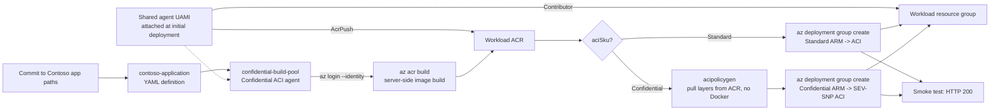

# Visual Attestation Demo v2 — container to ACI via the confidential build runners

A minimal pipeline scaffold that builds the
[`aci-samples/visual-attestation-demo-v2`](../../../aci-samples/visual-attestation-demo-v2/README.md)
container and deploys it to **Azure Container Instances** — every step running
**inside Azure DevOps** on the dockerless **confidential build runners**.

The image is built **server-side** with `az acr build` (so the confidential ACI
agents, which have no Docker daemon, can produce it) and deployed to a public
ACI container group. Pick the SKU at queue time with the **`aciSku`** parameter:

- **Standard** — plain ACI (no TEE). The app's **Attest** button fails by design
  (there is no `/dev/sev-guest`) — that failure *is* the educational point of
  the sample. The container still starts and serves the UI on port 80.
- **Confidential** — AMD SEV-SNP ACI. A per-image CCE policy is generated and
  injected before deploy, so runtime attestation **succeeds** on genuine
  hardware.

> **Both modes run on the dockerless `confidential-build-pool`.** Generating the
> CCE policy with `az confcom acipolicygen` normally implies a local Docker
> daemon, but that isn't needed here: because the image already lives in ACR
> (pushed by `az acr build`), confcom pulls the layers **straight from the
> registry** to compute the dm-verity hashes. The only thing it needs is
> registry auth, which the pipeline hands it by writing `~/.docker/config.json`
> with the ACR admin credentials — no Docker install involved. See the
> [confcom docs](https://github.com/Azure/azure-cli-extensions/blob/main/src/confcom/azext_confcom/README.md):
> *"the confcom extension CLI tool attempts to fetch the image remotely if it is
> not locally available."* For a confidential, attestation-gated **Secure Key
> Release** example see the sibling
> [`secretapp-helloworld`](../secretapp-helloworld/README.md).

## Contents

- [What gets created](#what-gets-created)
- [Flow](#flow)
- [One-time setup in Azure DevOps](#one-time-setup-in-azure-devops)
- [Onboarding a developer (edit → push → redeploy)](#onboarding-a-developer-edit--push--redeploy)
- [Portability — using a registry other than ACR](#portability--using-a-registry-other-than-acr)
- [Clean up](#clean-up)
- [3‑minute demo script](DEMO-SCRIPT.md) — narration for showing how the pipeline prevents deploying to non‑confidential infrastructure

## What gets created

| File | Purpose |
| --- | --- |
| `azure-pipelines.yml` | Build (`az acr build`) once, then a Standard or Confidential deploy + HTTP 200 smoke test, all on the `confidential-build-pool`. |
| `deploy/aci-visual-attestation.json` | ARM template for a public **Standard** ACI container group (`cc-attest`, port 80, admin-cred ACR pull). |
| `deploy/aci-visual-attestation-confidential.json` | ARM template for a public **Confidential** (SEV-SNP) ACI container group with an empty `ccePolicy` that `acipolicygen` fills in at deploy time. |

The container **source** (Dockerfile, `app.py`, templates) is not duplicated
here — the pipeline uses `checkout: self` and builds straight from
`aci-samples/visual-attestation-demo-v2`.

## Flow



## One-time setup in Azure DevOps

1. **Agent pool** — confirm the `confidential-build-pool` pool has at least one
   online confidential ACI agent (provisioned by the parent
   [`usecase-ado-server-iaas` guide](../../README.md)).

  The pipeline calls `az` directly and installs it only if the agent image does
  not already provide it.

2. **Azure Container Registry** — a Basic (or higher) ACR with the admin user
   enabled: `az acr update -n <acr-name> --admin-enabled true`.

3. **Managed identity** — attach the shared agent user-assigned identity during
  the confidential ACI agent deployment. Grant it persistent `Contributor` on
  the workload resource group and `AcrPush` on the workload ACR. No ARM service
  connection is required, and pipeline execution must not depend on PIM.

4. **Create the pipeline** — run `Create-HelloWorldPipeline.ps1` from the parent
  guide. It creates or updates this Contoso definition, exposes the confidential
  pool to the project, and grants the required pool and repository permissions.

5. **Pipeline variables** — Edit → Variables, add:

   | Variable | Example | Notes |
   | --- | --- | --- |
  | `subscriptionId` | `<subscription-id>` | Subscription used by the managed identity login. |
  | `miClientId` | `<client-id>` | Client ID of the identity attached to the agents. |
   | `acrName` | `<acr-name>` | Registry name, no `.azurecr.io`. |
   | `resourceGroup` | `<resource-group>` | Holds the ACR + ACI. |
   | `location` | `northeurope` | Any ACI-capable region. Use one with **Confidential ACI** capacity for the Confidential SKU (e.g. `eastus`, `northeurope`, `westeurope`). |

   The `maaEndpoint` used by the Confidential SKU defaults to
   `sharedeus.eus.attest.azure.net` (eastus). If you deploy elsewhere, override
   it in the `variables:` block (e.g. `sharedneu.neu.attest.azure.net` for
   northeurope).

6. **Run it.** The introducing push may not trigger a definition that did not
  exist yet, so let the provisioning helper queue newly created definitions once
  or manually queue the first run. Pick the **ACI SKU** (`Standard` or
  `Confidential`) at queue time. When it finishes, the deploy stage log prints
  `App URL: http://<dns>.<region>.azurecontainer.io`. On the Confidential SKU,
  click **Attest** in the UI for a live SEV-SNP token.

## Onboarding a developer (edit → push → redeploy)

Once the pipeline exists, a developer never has to touch Azure DevOps in the
browser. Because the ADO Server has **no public IP**, they reach it through an
**Azure Bastion tunnel** that forwards a local port to the server's HTTPS
endpoint; after cloning, an ordinary `git push` to `main` triggers the pipeline
(`trigger: main`) and redeploys the container automatically.

Hand the developer the following. Replace the placeholders with the values from
your deployment (`<subscription-id>`, `<rg>`, `<vm-name>`, `<bastion-name>`,
`<collection>`, `<project>`, `<repo>`).

**Prerequisites for the developer**

- [Azure CLI](https://learn.microsoft.com/cli/azure/install-azure-cli) with the Bastion extension (`az extension add --name bastion`) and `git`.
- `az login` access to the subscription hosting the ADO Server VM.
- An Azure DevOps **Personal Access Token (PAT)** on that server with **Code (Read & Write)** — you (the operator) generate it and hand it over securely.

**1. Open the Bastion tunnel** (leave running in its own terminal — forwards `localhost:8443` → server `:443`):

```powershell
$vmId = az vm show -g <rg> -n <vm-name> --query id -o tsv
az network bastion tunnel `
  --name <bastion-name> --resource-group <rg> `
  --target-resource-id $vmId --resource-port 443 --port 8443
```

> If `8443` is already in use, a tunnel is already open — reuse it or pick another local port and adjust the URLs below.

**2. Provide the PAT** (kept out of shell history):

```powershell
$env:AZP_TOKEN = Read-Host "ADO PAT" -AsSecureString | ConvertFrom-SecureString -AsPlainText
```

**3. Clone through the tunnel.** Prefer a server certificate trusted by developer
workstations. For recovery with the sample's self-signed certificate, disable TLS
verification for this one clone command only:

```powershell
$remote = "https://user:$env:AZP_TOKEN@localhost:8443/<collection>/<project>/_git/<repo>"
git -c http.sslVerify=false clone $remote
cd <repo>
git config user.name  "<name>"
git config user.email "<email>"
```

Configure certificate trust before normal pull/push use. Do not persist
`http.sslVerify=false`, and avoid keeping a PAT in a remote URL outside a disposable
recovery clone because it remains in `.git/config`.

**4. Edit, push, and watch it redeploy.** Work in a **separate VS Code window** from the one managing the Azure/ADO infrastructure:

```powershell
git add -A; git commit -m "your change"; git push   # triggers the pipeline
```

Every push to `main` runs build → confidential deploy → HTTP 200 smoke test on
the `confidential-build-pool`. The build agents authenticate with a **managed
identity** (no service connection or secrets in the pipeline); the tunnel is only
needed for git. The developer can confirm the result without the ADO UI:

```powershell
az container list -g <rg> `
  --query "[?starts_with(name,'cc-attest-conf')].{name:name, state:instanceView.state, fqdn:ipAddress.fqdn}" -o table
```

Browsing to the FQDN and clicking **Attest** returns a live `sevsnpvm` MAA token
on the Confidential SKU.

## Portability — using a registry other than ACR

The **dockerless CCE policy step is registry-agnostic.** `az confcom
acipolicygen` (via its bundled `dmverity-vhd` tool) pulls image layers over the
standard **OCI / Docker Registry v2 HTTP API**, authenticated by whatever entry
it finds in `~/.docker/config.json`. So it works unchanged against Docker Hub,
GHCR, Quay, Harbor, or a self-hosted `registry:2` running inside a CVM —
provided three things hold:

- **Reachability.** The `confidential-build-pool` agents must be able to reach
  the registry. ACR here is reached over the private VNet; Docker Hub/GHCR are
  reached via the agents' NAT-gateway egress; a registry hosted in a CVM must be
  on the same VNet (or peered) with DNS + NSG rules that let the agents in.
- **TLS.** Layers are fetched over HTTPS, so a self-hosted registry must present
  a certificate the agent trusts (public registries already do). A plain-HTTP or
  self-signed registry needs its CA baked into the agent image's trust store.
- **Auth.** Add the registry's credentials to `~/.docker/config.json` keyed by
  its host (`index.docker.io` for Docker Hub, `myregistry.example:5000` for a
  CVM-hosted one) instead of the ACR login server.

What is **not** portable is the rest of the pipeline, which leans on ACR-specific
features you'd have to replace:

| Pipeline piece | ACR today | Swapping registries |
| --- | --- | --- |
| **Image build** | `az acr build` builds the image **server-side** — essential because the confidential agents have no Docker daemon. | Docker Hub / a CVM registry offer **no server-side build**. You'd need another dockerless builder (e.g. BuildKit/`buildctl` against a remote builder, or kaniko) to produce and push the image, then point `acipolicygen` at it. This is the hard part, not the policy generation. |
| **Credentials / host** | `az acr show --query loginServer`, `az acr credential show`. | Replace with the target registry's hostname and credential source (Docker Hub PAT, Harbor robot account, etc.). |
| **ACI image pull** (`imageRegistryCredentials` in the ARM template) | ACI pulls from ACR with admin creds. | ACI can pull from any registry given creds — but to pull from a registry **inside a CVM** on a private VNet, the container group must be VNet-injected with line-of-sight to it. |

**Bottom line:** the confidential attestation half (dockerless `acipolicygen`
+ remote layer fetch) ports cleanly to any OCI registry, including one you run in
a CVM. The build half is what's tied to ACR, because `az acr build` is the thing
letting a daemonless agent produce an image at all.

## Clean up

```bash
az container delete -g <resource-group> -n <container-group-name> --yes
```
