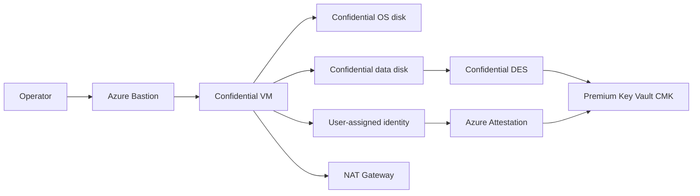

# Confidential Data Disk Encryption CVM sample

This sample deploys a Linux or Windows Azure confidential virtual machine (CVM) with confidential encryption for both the operating system disk and an attached data disk.

> [!IMPORTANT]
> Confidential Data Disk Encryption (CDDE) is a gated preview. The subscription must be approved and registered for `Microsoft.Compute/ConfidentialVMDataDiskEncryptionPreview`, and the selected region must support the preview.

## What the script deploys

[Build-ConfidentialDataDiskCVM.ps1](Build-ConfidentialDataDiskCVM.ps1) creates:

- A Generation 2 `ConfidentialVM` with Secure Boot and vTPM enabled.
- Confidential OS disk encryption using `DiskWithVMGuestState`.
- A Premium Azure Key Vault with RBAC and purge protection enabled.
- An exportable, HSM-backed, 3072-bit RSA customer-managed key (CMK) protected by a Secure Key Release policy.
- A confidential Disk Encryption Set (DES) using `ConfidentialVmEncryptedWithCustomerKey`.
- An empty Premium SSD data disk using `DataDiskEncryptedWithCustomerKey`.
- A user-assigned managed identity used by the CVM to release the key after successful attestation.
- Guest data encryption using LUKS2 on Linux or BitLocker on Windows.
- A private VM NIC with no public IP address.
- A NAT Gateway for required outbound connectivity.
- Standard Azure Bastion with tunneling for private SSH or RDP access.



The NAT Gateway and Bastion each use a public IP resource. Neither public IP is assigned to the VM NIC.

## Prerequisites

- PowerShell 7 or later.
- A current [Azure CLI](https://learn.microsoft.com/cli/azure/install-azure-cli), signed in to the target tenant and subscription.
- Permission to create resource groups, CVMs, managed identities, Key Vaults, keys, role assignments, networking resources, and Azure Bastion.
- An eligible **Owner** or **User Access Administrator** Microsoft Entra PIM role if role-assignment permission is not already active. The script checks this permission and offers to activate an eligible role for one hour.
- Registered resource providers:
  - `Microsoft.Compute`
  - `Microsoft.KeyVault`
  - `Microsoft.ManagedIdentity`
  - `Microsoft.Network`
- Registered preview feature `Microsoft.Compute/ConfidentialVMDataDiskEncryptionPreview`.
- Sufficient regional quota for the selected confidential VM SKU.
- An SSH public key for Linux deployments.
- The CDDE Secure Key Release policy described below.

The sample was validated with `Standard_DC2ads_v5` in `centraluseuap`. Preview availability can differ by subscription and can change over time.

The script also provides three CVM profiles that select a matching SKU. All profiles default to `centraluseuap` because CDDE is a gated preview with limited regional availability:

| Profile | Isolation | SKU |
|---|---|---|
| `-V5` | AMD SEV-SNP v5 | `Standard_DC2as_v5` |
| `-V6` | AMD SEV-SNP v6 | `Standard_DC2as_v6` |
| `-TDX` | Intel TDX v6 | `Standard_DC2es_v6` |

Pass `-Location` with a profile to use another CDDE-enabled region. Do not combine profiles or combine a profile with `-VmSize`. CDDE preview and SKU availability must still be confirmed for the selected region.

## Regional test matrix

> [!CAUTION]
> **Microsoft internal use only.** This table is a point-in-time view from tests run on September 2-10, 2026, in one Microsoft subscription. Regional capacity, quota, SKU restrictions, and CDDE preview availability can vary by subscription and can change without notice. Do not treat these results as a public availability statement or deployment guarantee.

`Passed end to end` means that VM deployment, confidential data-disk attachment, the guest CDDE extension, and guest encryption verification all succeeded. `CVM passed` confirms only confidential VM deployment and attestation, not CDDE availability.

| Region | OS | SKU and isolation | CVM result | CDDE result |
|---|---|---|---|---|
| Central US EUAP (`centraluseuap`) | Ubuntu 22.04 | `Standard_DC2ads_v5`, AMD SEV-SNP v5 | Passed. A later retry failed with transient `InternalDiskManagementError`. | Passed end to end: `CDELinux` succeeded, the data disk used `DataDiskEncryptedWithCustomerKey`, and LUKS2 was verified at `/cde-data`. |
| Central US EUAP (`centraluseuap`) | Windows Server 2022 | `Standard_DC2ads_v5`, AMD SEV-SNP v5 | Passed VM and confidential data-disk creation in a clean deployment. | Passed end to end: the data disk used `DataDiskEncryptedWithCustomerKey`, `CDEWindows` succeeded, and the healthy NTFS `F:` volume reported BitLocker protection on, fully encrypted, and 100% encryption. |
| Central US EUAP (`centraluseuap`) | Ubuntu 22.04 | `Standard_DC2as_v6`, AMD SEV-SNP v6 | Failed before VM creation: `standardDCasv6Family` quota was `0`; at least 2 vCPUs were required. | Not tested because VM deployment was blocked by quota. |
| North Europe (`northeurope`) | Linux | `Standard_DC2as_v5`, AMD SEV-SNP v5 | Passed deployment and returned `sevsnpvm` / `azure-compliant-cvm` attestation. | Data-disk attachment failed with Azure Compute HTTP 500; CDDE was not validated. |
| West US 2 (`westus2`) | Linux | `Standard_DC2as_v6`, AMD SEV-SNP v6 | Passed deployment and returned `sevsnpvm` / `azure-compliant-cvm` attestation. | Failed during confidential data-disk attachment with `InternalOperationError`; the VM, CMK, confidential DES, and identities were created first. |
| West Europe (`westeurope`) | Linux | `Standard_DC2es_v6`, Intel TDX | Passed deployment and returned `tdxvm` / `azure-compliant-cvm` attestation. | Not tested. |
| East US 2 EUAP (`eastus2euap`) | Linux | `Standard_DC2as_v6`, AMD SEV-SNP v6 | Passed deployment and returned `sevsnpvm` / `azure-compliant-cvm` attestation. | Not tested. |
| Korea Central (`koreacentral`) | Linux | `Standard_DC2as_v6`, AMD SEV-SNP v6 | Passed deployment and returned `sevsnpvm` / `azure-compliant-cvm` attestation when SKU preflight was skipped. | Not tested. |

Successful CVM attestation confirms that the VM SKU can run as a confidential VM in that test context. It does not confirm that the gated CDDE preview is enabled in the same region.

## Secure Key Release policy

The script requires `DataDiskSKRPolicy.json`. This policy controls when Key Vault may release the CMK. It requires attestation evidence for an Azure-compliant confidential VM using AMD SEV-SNP or Intel TDX.

The preview documentation and policy are intentionally excluded from Git by the repository `.gitignore`. Obtain the approved CDDE preview package through the applicable Microsoft preview channel, then either:

1. Place the policy at the default location:

   `vm-samples/confidential-data-disk-encryption/cdde-preview/DataDiskSKRPolicy.json`

2. Or pass its local path with `-PolicyPath`.

Do not weaken or reconstruct the policy from region names. Use the policy supplied with the preview package unchanged unless Microsoft provides different guidance.

## Sign in and select the subscription

```powershell
az login
az account set --subscription '<subscription-id>'
```

The script always passes `-SubscriptionId` to Azure CLI operations, reducing the risk of using a different default subscription accidentally.

## Deploy Linux

```powershell
./Build-ConfidentialDataDiskCVM.ps1 `
    -SubscriptionId '<subscription-id>' `
    -Linux `
    -V5 `
    -BaseName 'mycdelinux' `
    -SshPublicKeyPath '~/.ssh/id_rsa.pub'
```

The data disk is formatted as ext4, mounted at `/cde-data`, and converted to LUKS2 by the `CDELinux` extension.

For generated username/password authentication instead of an SSH key, pass `-PasswordAuthentication`. The script prints the generated password once at the end of a successful deployment.

```powershell
./Build-ConfidentialDataDiskCVM.ps1 `
    -SubscriptionId '<subscription-id>' `
    -Linux `
    -PasswordAuthentication
```

## Deploy Windows

```powershell
./Build-ConfidentialDataDiskCVM.ps1 `
    -SubscriptionId '<subscription-id>' `
    -Windows `
    -V6 `
    -BaseName 'mycdewindows'
```

The data disk is initialized as GPT, formatted as NTFS with label `CDEData`, assigned a drive letter, and encrypted by the `CDEWindows` extension. At the end of a successful deployment, the script prints a direct Azure portal link, the administrator username, and a randomly generated password. Save the password securely; Azure cannot return it later.

## Deploy Intel TDX

```powershell
./Build-ConfidentialDataDiskCVM.ps1 `
    -SubscriptionId '<subscription-id>' `
    -Linux `
    -TDX `
    -BaseName 'mycdetdx' `
    -SshPublicKeyPath '~/.ssh/id_rsa.pub'
```

## Parameters

| Parameter | Description | Default |
|---|---|---|
| `SubscriptionId` | Target Azure subscription ID. | Required |
| `Linux` | Deploy an Ubuntu 22.04 confidential VM. | Linux parameter set |
| `Windows` | Deploy a Windows Server 2022 confidential VM. | Windows parameter set |
| `Prefix` | Prefix used when generating a random base name. | `sgall` |
| `BaseName` | Stable base name for resources. Must be lowercase alphanumeric and 3–15 characters. | Generated |
| `Location` | Azure region for all resources. | `centraluseuap` |
| `VmSize` | Confidential VM SKU. | `Standard_DC2ads_v5` |
| `V5` | Select AMD SEV-SNP v5 (`Standard_DC2as_v5`). | Off |
| `V6` | Select AMD SEV-SNP v6 (`Standard_DC2as_v6`). | Off |
| `TDX` | Select Intel TDX v6 (`Standard_DC2es_v6`). | Off |
| `AdminUsername` | Guest administrator username. | `azureuser` |
| `SshPublicKeyPath` | Linux SSH public key path. | `~/.ssh/id_rsa.pub` |
| `PasswordAuthentication` | Use a generated password instead of an SSH key for Linux. | Off |
| `DataDiskSizeGB` | Data disk capacity in GiB. | `32` |
| `DataDiskLun` | Data disk LUN. | `0` |
| `PolicyPath` | Local CDDE Secure Key Release policy path. | `cdde-preview/DataDiskSKRPolicy.json` |
| `ResourceGroupName` | Resource group name. | `<BaseName>-cdde-rg` |

Use a unique `BaseName`: Azure Key Vault names are globally unique, and purge protection prevents immediate reuse after deletion.

## CMK and identity flow

1. The script creates an exportable `RSA-HSM` key with `wrapKey` and `unwrapKey` operations.
2. The CDDE Secure Key Release policy is attached during key creation.
3. The confidential DES references the CMK URL.
4. The DES identity receives **Key Vault Crypto Service Encryption User**.
5. The CVM user-assigned identity receives:
   - **Key Vault Crypto Service Encryption User**
   - **Key Vault Crypto Service Release User**
6. The CVM identity requests key release using confidential-VM attestation evidence.
7. Key Vault releases key material only when the evidence satisfies the key's release policy.

“Exportable” does not make the CMK generally downloadable. Export is constrained by Key Vault authorization and the Secure Key Release policy.

## Remote access

The script prints the complete Bastion command after deployment.

### Linux SSH

```powershell
az network bastion ssh `
    --subscription '<subscription-id>' `
    --name '<base-name>-bastion' `
    --resource-group '<resource-group>' `
    --target-resource-id '<vm-resource-id>' `
    --auth-type ssh-key `
    --username azureuser `
    --ssh-key '~/.ssh/id_rsa'
```

### Windows RDP

```powershell
az network bastion rdp `
    --subscription '<subscription-id>' `
    --name '<base-name>-bastion' `
    --resource-group '<resource-group>' `
    --target-resource-id '<vm-resource-id>'
```

## Validate encryption

CDDE runs asynchronously in the guest. Wait for the extension to report `Succeeded` before validating guest encryption.

### Linux

```powershell
az vm extension show `
    --subscription '<subscription-id>' `
    --resource-group '<resource-group>' `
    --vm-name '<vm-name>' `
    --name CDELinux `
    --expand instanceView

az vm run-command invoke `
    --subscription '<subscription-id>' `
    --resource-group '<resource-group>' `
    --name '<vm-name>' `
    --command-id RunShellScript `
    --scripts 'sudo lsblk -f; sudo dmsetup ls; findmnt /cde-data'
```

Confirm that the data disk reports `crypto_LUKS` version `2` and `/cde-data` resolves through a device-mapper path.

#### Linux demo walkthrough

Set the deployment values, then show that Azure configured LUN 0 with confidential customer-managed-key encryption:

```powershell
$subscriptionId = '<subscription-id>'
$resourceGroup = '<resource-group>'
$vmName = '<vm-name>'
$apiVersion = '2026-03-01'
$vmUrl = "https://management.azure.com/subscriptions/$subscriptionId/resourceGroups/$resourceGroup/providers/Microsoft.Compute/virtualMachines/${vmName}?api-version=$apiVersion"

az rest `
    --method get `
    --url $vmUrl `
    --query "properties.storageProfile.dataDisks[].{LUN:lun,SizeGiB:diskSizeGB,Encryption:managedDisk.securityProfile.securityEncryptionType,DiskEncryptionSet:managedDisk.securityProfile.diskEncryptionSet.id}" `
    --output table

az vm extension show `
    --subscription $subscriptionId `
    --resource-group $resourceGroup `
    --vm-name $vmName `
    --name CDELinux `
    --expand instanceView `
    --query "{State:provisioningState,Status:instanceView.statuses[0].displayStatus}" `
    --output table
```

The data disk should report `DataDiskEncryptedWithCustomerKey`, and `CDELinux` should report `Succeeded`.

Connect through Bastion using the authentication mode selected during deployment. For generated password authentication:

```powershell
az network bastion ssh `
    --subscription $subscriptionId `
    --resource-group $resourceGroup `
    --name '<base-name>-bastion' `
    --target-resource-id "/subscriptions/$subscriptionId/resourceGroups/$resourceGroup/providers/Microsoft.Compute/virtualMachines/$vmName" `
    --auth-type password `
    --username azureuser
```

Inside the VM, show the LUKS2 header, device-mapper path, persistent mapping, and mounted filesystem:

```bash
sudo lsblk -o NAME,TYPE,FSTYPE,SIZE,MOUNTPOINTS && sudo cryptsetup luksDump /dev/disk/azure/scsi1/lun0 | head -30 && sudo dmsetup ls --tree && sudo cat /etc/crypttab && findmnt /cde-data
```

Finish with a non-destructive write/read demonstration on the encrypted volume:

```bash
echo "CDDE demo $(date -Is)" | sudo tee /cde-data/demo.txt
sudo sync
sudo cat /cde-data/demo.txt
df -h /cde-data
```

### Windows

```powershell
az vm extension show `
    --subscription '<subscription-id>' `
    --resource-group '<resource-group>' `
    --vm-name '<vm-name>' `
    --name CDEWindows `
    --expand instanceView

az vm run-command invoke `
    --subscription '<subscription-id>' `
    --resource-group '<resource-group>' `
    --name '<vm-name>' `
    --command-id RunPowerShellScript `
    --scripts "Get-BitLockerVolume | Format-List MountPoint,VolumeType,ProtectionStatus,VolumeStatus,EncryptionPercentage"
```

Confirm that the `CDEData` volume has protection enabled and is fully encrypted.

## Security considerations

- The VM NIC has no public IP address and receives no default outbound access.
- NAT Gateway supplies outbound-only internet connectivity required by the VM agent and extension.
- Bastion is the remote administration boundary; restrict who can use it with Azure RBAC.
- Key Vault purge protection is enabled and is not disabled by this sample.
- CMK access uses managed identities and scoped Key Vault RBAC roles.
- Generated Windows and Linux passwords are written to the console and may appear in terminal history or captured deployment logs. Protect those logs and rotate the password after first use when appropriate.
- This sample is intended for preview evaluation. Review organizational policy, networking, monitoring, backup, and business-continuity requirements before adapting it for production.

## Troubleshooting

### Role assignment returns `Forbidden`

Activate an eligible Owner or User Access Administrator PIM role. If activation is already shown as provisioned but writes still fail, refresh the Azure CLI authentication context and retry after RBAC propagation.

### Key creation returns `ForbiddenByRbac`

The **Key Vault Crypto Officer** assignment can take several minutes to propagate. The script retries key creation automatically.

### VM size is unavailable or restricted

Choose a region and confidential VM SKU enabled for both the subscription and the CDDE preview. The script checks SKU restrictions and family quota before creating resources.

### Key Vault name already exists

Choose a different `BaseName`. A deleted purge-protected vault cannot be immediately recreated with the same name.

### Windows data disk is not found

Azure Windows data disks can appear with a `SAS` or `SCSI` bus type. The script accepts both and excludes boot and system disks.

## Cleanup

Deleting the resource group removes the CVM, disks, identities, networking, Bastion, DES, and Key Vault resource:

```powershell
az group delete `
    --subscription '<subscription-id>' `
    --name '<resource-group>' `
    --yes
```

Because purge protection is enabled, the Key Vault remains recoverable until its retention period expires and its name cannot be reused immediately.

## References

- [Azure confidential VM overview](https://learn.microsoft.com/azure/confidential-computing/confidential-vm-overview)
- [Azure managed disk encryption options](https://learn.microsoft.com/azure/virtual-machines/disk-encryption-overview)
- [Use customer-managed keys with Azure managed disks](https://learn.microsoft.com/azure/virtual-machines/disks-enable-customer-managed-keys-portal)
- [Secure Key Release and attestation](https://learn.microsoft.com/azure/confidential-computing/concept-skr-attestation)
- [Azure Bastion documentation](https://learn.microsoft.com/azure/bastion/)
