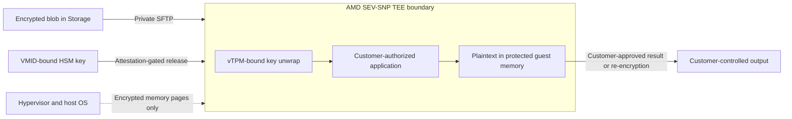
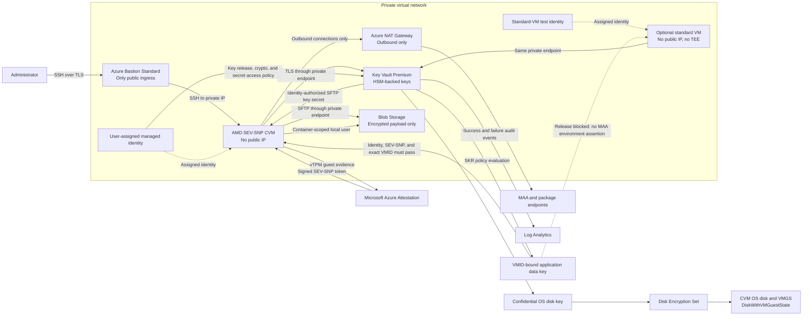
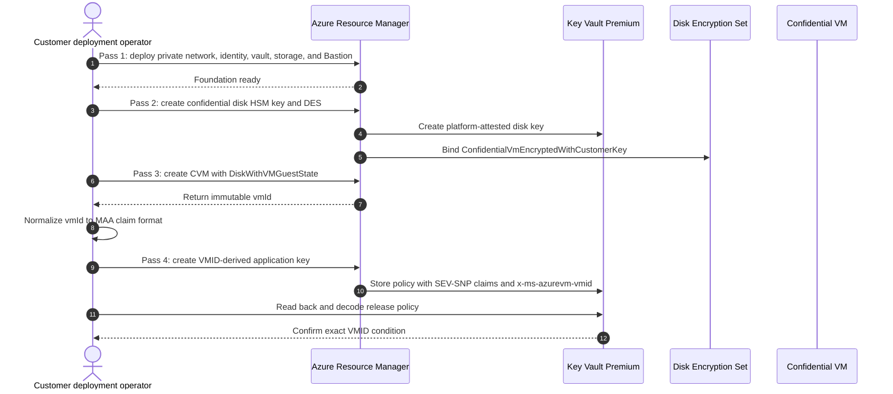
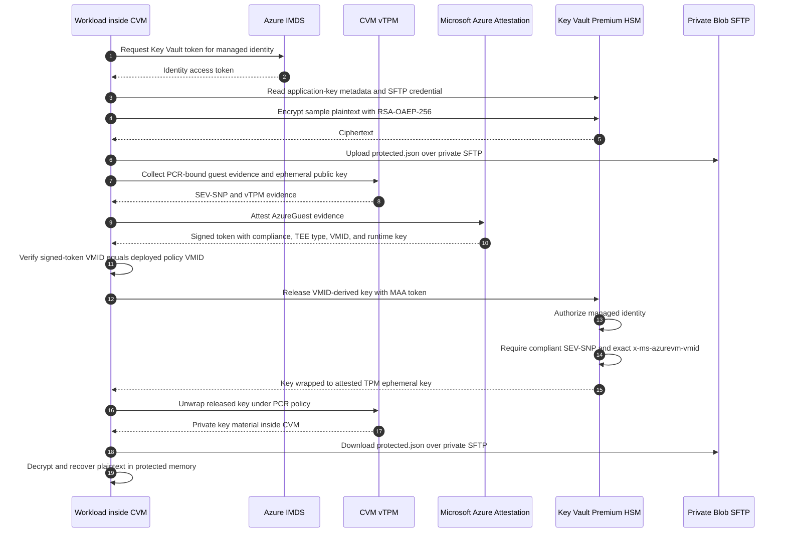
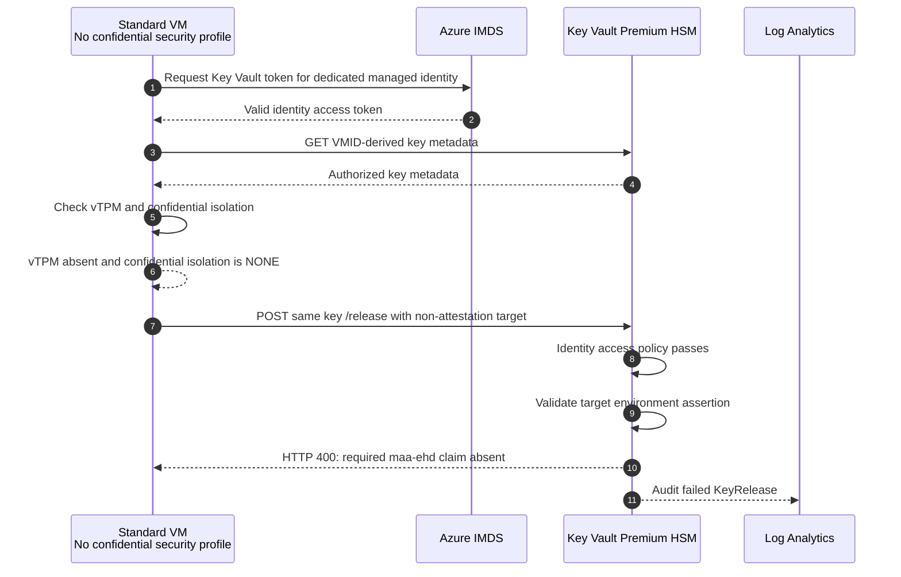

# Private Confidential VM with Secure Key Release

This sample deploys an AMD SEV-SNP Azure Confidential VM (CVM), encrypts its OS disk with a customer-managed HSM key, and demonstrates application data that can be decrypted only after identity authorization, guest attestation, and exact Azure VMID matching all succeed.

The CVM has no public IP. Azure Key Vault and Blob Storage have public network access disabled and are reached through private endpoints. Azure Bastion Standard provides the only inbound path. A NAT Gateway provides outbound-only access for MAA and package installation without exposing the CVM to inbound Internet traffic.

The central idea is that possession of the ciphertext, control of the Azure host, or permission to call Key Vault is not sufficient by itself. Plaintext becomes available only when the customer-selected identity is running inside a hardware-isolated environment that satisfies the customer-selected key release policy. The customer controls the keys, policy, identities, network paths, and revocation actions that define that decision.

## TEE basics

A **Trusted Execution Environment (TEE)** is a hardware-enforced boundary that protects code and data while they are being used. Traditional encryption protects data while it is stored or moving across a network, but an ordinary VM must expose usable plaintext to the host-controlled memory system during processing. A confidential VM changes that boundary: the CPU encrypts guest memory and isolates it from the hypervisor, host operating system, and other VMs.

This sample uses an AMD SEV-SNP confidential VM. At a high level:

| Concept | Meaning in this sample |
|---|---|
| Hardware isolation | AMD SEV-SNP gives the CVM its own encrypted memory context, separated from the Azure host and other VMs. |
| Memory confidentiality | Data written outside the CPU package is encrypted with hardware-managed keys that aren't available to the hypervisor. |
| Memory integrity | SEV-SNP helps detect unauthorized remapping or modification of protected guest memory by the host. |
| Trusted boot state | Secure Boot and the virtual TPM record boot state and protect TPM-sealed material. |
| Attestation | The CPU and vTPM produce signed evidence describing the environment. MAA validates that evidence and issues a signed token. |
| Relying party | Key Vault acts as the relying party. It releases a key only when identity, TEE claims, and exact VMID satisfy customer policy. |

### Where plaintext exists

Plaintext must exist logically for an application to calculate on it. Inside the TEE, customer-authorized code can read plaintext in CPU registers, caches, and protected guest memory. When memory leaves the CPU's protected boundary, SEV-SNP encrypts it. The hypervisor and host therefore handle encrypted memory pages rather than the customer's usable plaintext.



The application key is wrapped to a TPM-protected ephemeral key contained in the attestation token. It is unwrapped only inside the attested CVM. The application decrypts the protected blob inside SEV-SNP memory, processes it there, and must either return an explicitly approved result to the customer or encrypt data again before it leaves the TEE.

### What the TEE does not mean

- A TEE does not eliminate plaintext inside the authorized computation; it prevents infrastructure outside the TEE from reading that plaintext.
- A TEE does not protect against malicious or vulnerable code already running inside the guest. Customers must review, patch, and govern the workload and guest administrators.
- A TEE alone does not protect stored files or network traffic. This sample also uses application encryption, confidential OS disk encryption, TLS/SFTP, and private endpoints.
- Attestation proves properties represented by signed claims. This sample additionally pins the application key to one Azure VMID and one managed identity; it does not claim that every application binary is independently measured by the release policy.
- “Visible only to the customer” means visible to customer-approved code and customer-authorized users inside the guest boundary. That code can intentionally disclose plaintext, so its behavior remains part of the trusted computing base.

## Topology



The two HSM keys intentionally have different lifecycles. The confidential OS disk key must exist before the VM can boot, so it uses the Azure platform-attestation policy required by confidential disk encryption. The application key is created only after the VM exists, allowing its policy to include that VM's exact Azure VMID.

## Deployment sequence



The application key name includes the first 12 hexadecimal characters of the normalized VMID, for example `private-data-key-a96397e37e39`. Key Vault does not allow changing the release policy of an existing exportable key, so a replacement VM receives a newly named application key rather than mutating the policy of the old key.

## Runtime SKR sequence



## Standard VM failure sequence



The standard VM is deliberately given `get` and `release` permissions on the same VMID-derived application key. This removes “the caller lacked permission” as an explanation for failure. It can authenticate and read key metadata, but it cannot produce SEV-SNP/vTPM evidence or a valid MAA environment assertion. Key Vault therefore fails closed before it can release any key material.

## Pattern

1. Azure Key Vault Premium creates two exportable RSA-HSM keys with separate Secure Key Release (SKR) policies.
2. `confidential-os-disk-key-v2` protects a Disk Encryption Set configured as `ConfidentialVmEncryptedWithCustomerKey`.
3. The CVM OS disk uses `DiskWithVMGuestState`, protecting the OS disk and VM guest state before first boot.
4. After the CVM exists, the deployment reads its immutable Azure `vmId` and creates a VMID-derived application key such as `private-data-key-a96397e37e39`, requiring that exact value as `x-ms-azurevm-vmid`.
5. The VMID-derived application key encrypts a small plaintext with RSA-OAEP-256. Only ciphertext is uploaded to Blob Storage over private SFTP.
6. The CVM authenticates as one user-assigned managed identity, obtains AMD SEV-SNP evidence from its vTPM, and sends the evidence to Microsoft Azure Attestation (MAA).
7. Key Vault checks the managed identity's `release` permission and then requires compliant SEV-SNP claims plus the exact CVM VMID in the signed MAA token.
8. The released private key is used only in CVM memory to decrypt the blob. The sample never writes or prints private key material.

## End-to-end protection chain

The demo protects data through a chain of independent controls. An attacker must defeat every applicable control, not merely gain access to one Azure resource.

1. **The customer defines the trusted execution condition.** The release policy on the VMID-derived application key names the accepted MAA authority, requires a compliant AMD SEV-SNP guest, and pins the exact Azure VMID. The policy is attached to the HSM-backed key, rather than implemented as an application-side check that could be skipped.
2. **The customer defines the authorized workload identity.** The user-assigned managed identity has only the Key Vault operations needed to read key metadata, encrypt, release, and retrieve the SFTP credential. A machine with valid SEV-SNP evidence but without this identity cannot call the key successfully.
3. **The platform proves the execution environment.** The CVM obtains signed evidence through its vTPM. MAA validates the AMD certificate chain, launch measurements, firmware state, debug state, and Azure compliance before issuing an environment assertion.
4. **Key Vault combines identity, attestation, and instance identity.** Key Vault first authorizes the caller, then evaluates the signed MAA claims against the release policy. A normal VM, a forged token, an unapproved identity, a noncompliant CVM, or a different compliant CVM fails before private key material is released.
5. **Released key material remains bound to the TEE.** Key Vault wraps the released HSM key to an ephemeral RSA key represented in the attestation token. The corresponding private key is recreated and used through the CVM's vTPM and PCR policy. The application unwraps the released key only inside the running confidential guest.
6. **Plaintext is produced only inside protected memory.** The encrypted object is downloaded from private Blob Storage, the released key is unwrapped in the CVM, and RSA-OAEP-256 decryption happens in SEV-SNP-protected memory. The sample does not upload plaintext or persist the released private key.

This gives the workload three independent gates:

```text
Key release = authorized identity AND approved SEV-SNP claims AND exact Azure VMID
```

No gate substitutes for another. Identity prevents an unauthorized workload from calling the key, attestation rejects ordinary or noncompliant machines, and VMID pinning rejects a different compliant CVM even if a privileged operator attaches the same managed identity to it.

The application-key release policy requires two nested TEE claims and one top-level VM identity claim:

```text
x-ms-isolation-tee.x-ms-compliance-status = azure-compliant-cvm
x-ms-isolation-tee.x-ms-attestation-type  = sevsnpvm
x-ms-azurevm-vmid                         = <exact CVM vmId>
```

The first two claims identify a compliant AMD SEV-SNP environment. The third binds release to one Azure VM instance. A Key Vault access policy separately identifies the workload caller: the CVM's user-assigned identity receives runtime crypto, release, and SFTP-key secret permissions. All checks must pass. The deployment operator retains administrative key and secret permissions for setup and testing, so production deployments should separate provisioning from runtime administration and tightly restrict who can change access policies, key policies, or VM resources.

The MAA token also contains `x-ms-runtime.vm-configuration.vmUniqueId`, but Key Vault SKR policy matching does not support `x-ms-runtime.*` claims in this CVM flow. This sample therefore uses the separately issued top-level `x-ms-azurevm-vmid` claim. The deployment normalizes the ARM `vmId` to the token's uppercase representation, stores it in the application-key policy, reads the policy back through the management plane, and stops if the exact condition is absent. The guest independently checks that its signed MAA token contains the same VMID before requesting release.

## What the customer controls

The customer, rather than the application host, determines the conditions under which protected data can become plaintext:

| Customer-controlled decision | Where it is enforced | Effect |
|---|---|---|
| Which HSM keys protect the OS disk and application data | Key Vault Premium and Disk Encryption Set | Customer-selected keys, not platform-default keys, anchor data access. |
| Which hardware evidence is acceptable | Key release policy on each exportable HSM key | The HSM refuses release when attestation claims do not match. |
| Which exact CVM may receive the application key | `x-ms-azurevm-vmid` in the VMID-derived application-key policy | A different compliant CVM cannot release the key. |
| Which workload may request release | Managed identity and Key Vault access policies | Hardware and VMID compliance alone do not grant access. |
| Which administrators may provision, retrieve secrets, or alter policy | Entra identity, Azure roles, and Key Vault access policies | The customer defines and audits the administrative boundary. |
| Which network paths can reach data services | VNet, private endpoints, private DNS, NSG, Bastion, and NAT Gateway | Key Vault and Storage are unavailable over their public endpoints. |
| Where encrypted data is stored | Customer-owned Storage account and container | Storage operators see an application ciphertext, not the protected plaintext. |
| Whether future release remains possible | Key disablement, access-policy removal, identity removal, or network isolation | The customer can cryptographically revoke future access without recovering every ciphertext copy. |
| How release attempts are audited | Key Vault diagnostic settings and customer Log Analytics workspace | Successful and rejected releases are visible to the customer. |

The strongest control is cryptographic revocation. The customer can disable the VMID-derived application key, remove `release` from the workload identity, delete or replace the bound VM, create a more restrictive replacement key, or block the private endpoint path. Existing ciphertext then remains ciphertext even if it has been copied elsewhere.

“Customer-controlled” does not mean Azure is absent from the trust chain. This design relies on AMD SEV-SNP hardware and certificate infrastructure, Microsoft Azure Attestation to validate evidence, Azure Key Vault's HSM implementation, and the integrity of the selected guest image and bootstrap code. The customer controls configuration and release authority, while those services provide the hardware and verification mechanisms. Subscription owners and identity administrators can also change infrastructure or permissions; production governance must therefore protect those roles, deployment pipelines, and policy files.

## What each party can and cannot see

| Actor or compromise | What may be visible | What remains protected by this pattern |
|---|---|---|
| Blob Storage reader or copied storage media | `protected.json`, key identifier, and ciphertext | Application plaintext and the SKR-protected private key. |
| Azure host or hypervisor operator | VM scheduling metadata and encrypted guest memory/pages | SEV-SNP-protected guest memory and confidential OS disk contents. |
| Network observer | Connection metadata and encrypted TLS/SFTP traffic | Payload contents, credentials, attestation token contents in transit, and plaintext. |
| Operator with Bastion access | Whatever the guest account is authorized to access | HSM key release still requires the guest environment to attest successfully. |
| Identity with Key Vault `release` permission on a normal VM | Ability to authenticate and submit a request | Release policy rejects the non-attested environment. |
| Different compliant CVM without the selected managed identity | Valid hardware evidence | Key Vault authorization and VMID policy reject the caller. |
| Different compliant CVM with the selected managed identity | Valid hardware evidence and an authorized Azure identity | The signed `x-ms-azurevm-vmid` does not match the key policy. |
| Customer security administrator | Ability to disable keys, remove access, change policy, and inspect logs | Has deliberate control of the security boundary and must be governed accordingly. |

## Deploy

Prerequisites:

- Azure CLI, OpenSSH, and an interactive `az login`
- `Microsoft.Compute`, `Microsoft.KeyVault`, `Microsoft.Network`, `Microsoft.Storage`, `Microsoft.Insights`, and `Microsoft.OperationalInsights` resource providers
- DCas_v5 quota in the selected region
- Contributor permission to create the resources and update Key Vault access policies

From this directory:

```powershell
.\Deploy-PrivateCvm.ps1 -Prefix demo -Location northeurope
```

The deployment runs four passes: private foundation, confidential disk key and Disk Encryption Set, CVM creation, then VMID-derived application-key creation using the CVM's returned `vmId`. Before bootstrap, the script decodes the stored release policy and verifies the exact VMID condition. The final Azure Run Command confirms the signed MAA token carries that same VMID, seeds the encrypted blob, and proves attestation, SKR, TPM unwrap, and plaintext recovery. `-BootstrapOnly` derives the key name from the existing VMID, verifies its policy, and reruns only the guest proof.

Azure Bastion is billed hourly. Remove the sample when finished:

```powershell
.\Deploy-PrivateCvm.ps1 -Cleanup
```

## Access and decrypt

Use the connection command printed by the deployment script, or select **Connect > Bastion** on the VM in the Azure portal. The CVM itself has no public IP.

Inside the CVM, this is the command that downloads the ciphertext, attests, releases the key from Key Vault, and prints the plaintext:

```bash
sudo /opt/private-cvm/run-demo decrypt
```

The command contacts Key Vault over HTTPS and Storage over SFTP through private endpoints. MAA and package installation use outbound TLS; there is no inbound path to the CVM except Bastion.

## Prove another machine fails

### Deployed standard VM test

The optional negative test uses [negative-test.bicep](negative-test.bicep) to add a private Ubuntu VM with:

- Standard `Standard_D2as_v6` compute, with no confidential security profile
- No public IP; the same NAT Gateway provides outbound access
- The existing NSG, VNet, private DNS, and Key Vault private endpoint
- A dedicated managed identity with only `get` and `release` key permissions

Deploy it after the main demo:

```powershell
$sshPublicKey = ConvertTo-SecureString `
	(Get-Content .\.ssh\demo-private-cvm.pub -Raw).Trim() `
	-AsPlainText -Force

New-AzResourceGroupDeployment `
	-Name private-cvm-standard-negative `
	-ResourceGroupName demo-private-cvm-rg `
	-TemplateFile .\negative-test.bicep `
	-location northeurope `
	-baseName demo-<suffix> `
	-virtualNetworkName demo-<suffix>-vnet `
	-networkSecurityGroupName demo-<suffix>-cvm-nsg `
	-keyVaultName <vault-name> `
	-sshPublicKey $sshPublicKey
```

Run the release attempt inside the standard VM:

```powershell
$clientId = az identity show `
	-g demo-private-cvm-rg `
	-n demo-<suffix>-standard-id `
	--query clientId -o tsv

az vm run-command invoke `
	-g demo-private-cvm-rg `
	-n demo-<suffix>-standard-vm `
	--command-id RunShellScript `
	--scripts '@test-standard-vm.sh' `
	--parameters `
		keyVaultName=<vault-name> `
		keyName=<vmid-bound-key-name> `
		identityClientId=$clientId
```

The test submits the standard VM identity token as the release target after proving that identity can read the key. This is intentionally not an attestation token: a standard VM cannot generate the SEV-SNP environment assertion required by this key. Key Vault rejects the request before evaluating the policy's SEV-SNP and VMID values.

Observed output on August 24, 2026:

```text
Managed identity authorization: SUCCEEDED
Key metadata: https://<vault-name>.vault.azure.net/keys/private-data-key-a96397e37e39/<key-version>
vTPM device: ABSENT
Confidential isolation: NONE
Key release HTTP status: 400
{"error":{"code":"BadParameter","message":"Target environment attestation does not have the required enclave held data claim (maa-ehd)"}}
STANDARD_VM_SKR_BLOCKED
```

The standard VM had Azure VMID `ff3c1dd5-9316-44d0-84ef-9ed9d6171ebb`, distinct from the bound CVM VMID `a96397e3-7e39-43e4-8c3a-d10adcc59741`. The immediate rejection is the stronger, earlier failure: the caller supplied no valid environment assertion at all, so Key Vault never reached claim-value comparison or key wrapping.

Log Analytics recorded the failed release as HTTP `400`, `ResultSignature == "Bad Request"`, correlation `8d534c68-1b78-4264-8288-bb4520e2cc94`, with the same missing-`maa-ehd` description.

### Command-line caller test

Run the following on a standard, non-confidential machine that has private network and DNS access to the sample VNet, such as a VPN-connected workstation or a peered management VM:

```powershell
.\Test-NonConfidentialCaller.ps1 -VaultName <vault-name> -KeyName <vmid-bound-key-name>
```

The script authenticates normally and the deployment operator has `release` permission through a Key Vault access policy intentionally, so the request reaches SKR policy evaluation. It supplies the caller's valid Entra token as the release target, but that token is not an MAA environment assertion and has neither the required SEV-SNP claims nor an attested runtime encryption key. Key Vault rejects the release.

Because Key Vault public network access is disabled, an Internet-only workstation fails earlier at the network boundary. That is useful defense in depth, but it does not prove the release policy; use a non-CVM with private endpoint reachability for the policy test.

Equivalent release call:

```powershell
$target = az account get-access-token --resource https://vault.azure.net --query accessToken -o tsv
$body = @{ target = $target } | ConvertTo-Json -Compress
az rest --method post --resource https://vault.azure.net --url 'https://<vault>.vault.azure.net/keys/<vmid-bound-key-name>/<version>/release?api-version=7.4' --body $body
```

## Protection by stage

| Stage | Controls | Customer outcome |
|---|---|---|
| Before first boot | `ConfidentialVmEncryptedWithCustomerKey`, `DiskWithVMGuestState`, Secure Boot, vTPM, and a platform-attestation release policy | The OS disk and VMGS cannot be decrypted for a platform that fails confidential boot attestation. |
| Data at rest | Storage service encryption plus application-layer RSA-OAEP-256 ciphertext; RSA-HSM keys in Key Vault Premium | A Storage compromise or copied blob does not expose application plaintext. |
| Data in transit | TLS to Key Vault, SFTP to Blob, private endpoints and private DNS, SSH through Bastion | Service payloads and credentials are encrypted; the CVM has no inbound public address. |
| Data in use | AMD SEV-SNP memory encryption and integrity, vTPM-bound unwrap, guest-attestation SKR policy | Released key material and plaintext are handled only inside the approved confidential guest. |
| Identity and authorization | Dedicated managed identity, scoped Key Vault access policy, container-scoped SFTP local user | Access is limited to the intended workload and encrypted container. |
| Release decision | HSM-enforced release policy evaluated against signed SEV-SNP and VMID claims | Application code and ordinary administrators cannot bypass the hardware or exact-instance conditions merely by calling the API. |
| Revocation | Disable key, remove policy permission, detach identity, or isolate network | The customer can stop future decryptions centrally. |
| Operations and evidence | Key Vault audit diagnostics in Log Analytics | The customer can correlate successful and rejected releases with request IDs and identities. |

RSA is used directly only to keep this demo small. Production systems should use envelope encryption: encrypt data with a random AES-256 data-encryption key, wrap that key with the SKR-protected HSM key, and store the wrapped key beside the ciphertext.

## Production hardening

This repository is a demonstration, not a complete production security baseline. For production use:

- Separate deployment operators, Key Vault administrators, identity administrators, auditors, and workload identities.
- Remove the deployment operator's data-plane permissions after provisioning; use just-in-time elevation for maintenance.
- Restrict who can assign the user-managed identity or replace the VM. VMID binding blocks identity reuse on another CVM, but a principal that can also rewrite the key release policy remains in the trusted administrative boundary.
- Pin the guest image and attestation tooling to reviewed versions. Extend the release policy with approved measurements when the available MAA claims and lifecycle permit it.
- Use envelope encryption and short-lived data-encryption keys instead of directly encrypting business data with RSA.
- Rotate application wrapping keys and SFTP credentials on a defined schedule. Confidential disk CMK rotation has service-specific offline requirements.
- Store infrastructure and release-policy changes in a protected deployment pipeline with review and signed artifacts.
- Export audit logs to a separately governed monitoring subscription or immutable archive, and alert on failed `KeyRelease` operations and access-policy changes.
- Restrict NAT egress with an Azure Firewall or equivalent controlled egress path when the workload must contact only approved package and attestation endpoints.
- Define backup, recovery, and key-loss procedures. Purge protection prevents immediate key destruction, but loss of every usable key version makes application ciphertext unrecoverable.

## Customer-controlled lifecycle

| Lifecycle event | Customer action |
|---|---|
| Onboard a workload | Review the image and code, create a dedicated identity, select claims, and create new HSM-backed keys. |
| Grant access | Add only the required Key Vault permissions and private network path. |
| Operate | Monitor `KeyRelease`, identity changes, key changes, VM configuration, and network-policy changes. |
| Rotate | Create a replacement wrapping key and policy, rewrap data-encryption keys, validate recovery, then retire the old version. |
| Revoke | Disable the key or remove release permission first, then stop or isolate the workload. |
| Decommission | Verify retention requirements, remove identities and private endpoints, delete ciphertext as required, and schedule key deletion under soft-delete and purge-protection policy. |

VMID binding deliberately makes VM replacement a cryptographic lifecycle event. A recreated VM receives a different `vmId` and cannot release keys bound to the previous VM. Before planned replacement, create a newly named application key bound to the replacement VM, use envelope encryption to rewrap data-encryption keys under it, validate recovery, and only then retire the old VM and key.

Key Vault release policies are immutable for these exportable keys. In a production envelope-encryption design, create a new VMID-derived wrapping key and rewrap the data-encryption keys; bulk decryption and re-encryption of all business data is not required.

## Verified result

The VMID-bound revision was deployed and validated in North Europe on August 24, 2026. The live proof established:

| Check | Verified value |
|---|---|
| Azure VMID | `A96397E3-7E39-43E4-8C3A-D10ADCC59741` |
| VMID-derived key | `private-data-key-a96397e37e39` |
| Stored policy | Required `azure-compliant-cvm`, `sevsnpvm`, and the exact VMID above |
| Signed MAA token | Contained the same `x-ms-azurevm-vmid` |
| CVM posture | `ConfidentialVM`, Secure Boot enabled, vTPM enabled, `DiskWithVMGuestState`, no public IP |
| Storage posture | Public access disabled, shared-key access disabled, private SFTP enabled |
| In-CVM result | Encrypted upload, MAA attestation, SKR, TPM unwrap, and expected plaintext recovery succeeded |
| Success marker | `PRIVATE_CVM_DEMO_SUCCESS` |
| Key Vault audit | HTTP `200`, correlation `bc11e4da-e761-42bf-aee5-132821f69c4b` |

The final independent `-BootstrapOnly` rerun also completed successfully and returned Key Vault request ID `3d1ca0ba-d241-42c6-b369-1ede3286ce6e`.

## Audit successful and failed SKR

Key release is a Key Vault **data-plane** operation, so it is not listed as a release event in the subscription Activity Log. The template enables Key Vault audit diagnostics to Log Analytics, which is the Azure control-plane configuration that captures those events.

After running the CVM success command and the non-CVM failure command, open the deployed Log Analytics workspace and run:

```kusto
AzureDiagnostics
| where ResourceProvider == "MICROSOFT.KEYVAULT"
| where OperationName == "KeyRelease"
| project TimeGenerated, ResultSignature, httpStatusCode_d, ResultDescription, CallerIPAddress, identity_claim_oid_g, requestUri_s, CorrelationId
| order by TimeGenerated desc
```

Typical results are HTTP `200` with `ResultSignature == "OK"` for the attested CVM. A standard VM supplying no valid environment assertion returns HTTP `400` with `ResultSignature == "Bad Request"`; a valid attestation token whose claims fail policy can return HTTP `403` with `ResultSignature == "Forbidden"`. Diagnostic ingestion can take several minutes. Correlate the successful row's `CorrelationId` with the `x-ms-request-id` printed by `/opt/private-cvm/run-demo decrypt`.

You can query the same records from a command line:

```powershell
$workspaceId = az monitor log-analytics workspace show -g <resource-group> -n <workspace> --query customerId -o tsv
az monitor log-analytics query --workspace $workspaceId --analytics-query "AzureDiagnostics | where OperationName == 'KeyRelease' | order by TimeGenerated desc"
```

## References

- [Confidential VM overview](https://learn.microsoft.com/azure/confidential-computing/confidential-vm-overview)
- [Secure Key Release policy grammar](https://learn.microsoft.com/azure/key-vault/keys/policy-grammar)
- [Azure CVM guest attestation](https://github.com/Azure/cvm-attestation-tools)
- [Azure Bastion](https://learn.microsoft.com/azure/bastion/bastion-overview)